# Getting Started with AWS Generative AI for Developers

# [ >>> Amazon Bedrock Samples <<< ](https://github.com/aws-samples/amazon-bedrock-samples/tree/main)

## Module 01 - Core Concepts in Generative AI

### Foundation Models (FMs)

A **Foundation Model (FM)** is a large-scale machine learning model trained on a vast and diverse dataset of unlabeled data. This extensive pre-training allows it to learn general-purpose patterns, concepts, and knowledge. The key idea is that this "foundation" can be adapted (or fine-tuned) for a wide range of specific downstream tasks with minimal additional training.

*   **Pre-training:** The model learns from a massive corpus of data (e.g., the entire public internet) without specific instructions.
*   **Fine-tuning:** The pre-trained model is then trained on a smaller, task-specific dataset to specialize its capabilities.


**Example:**
*   **GPT-3 (Generative Pre-trained Transformer 3):** Trained on a huge amount of text data, it can be prompted to perform tasks like writing essays, translating languages, or answering questions, often without any task-specific fine-tuning.

### Multimodal Models

A **Multimodal Model** is an advanced type of foundation model that can process, understand, and generate information from multiple data types (modalities) simultaneously. This allows it to make connections between different kinds of information, such as text, images, audio, and video.

```mermaid
graph TD
    subgraph Inputs
        A[Text: What's in this image?]
        B[Image: 🖼️]
        C[Audio: 🎵]
    end
    subgraph Outputs
        D[Text: A cat playing a piano.]
        E[Image: 🎨]
    end
    Inputs --> F{Multimodal Model};
    F --> Outputs;
```



**Examples:**
*   **GPT-4:** Can analyze an image of a refrigerator's contents and a text prompt asking "What can I make for dinner?" to generate a text-based recipe.
*   **DALL-E 3:** Takes a detailed text description ("An astronaut riding a horse in a photorealistic style") and generates a corresponding image.

### AWS Bedrock

**AWS Bedrock** is a fully managed service that provides access to a selection of high-performing foundation models from various AI companies (like Anthropic, Cohere, Stability AI, and Amazon) through a single, unified API. It eliminates the need for developers to manage the complex infrastructure required to host and serve these large models.


**Example:**
A developer can use the same AWS SDK to call Anthropic's **Claude** for advanced reasoning and text generation, and then call Stability AI's **Stable Diffusion** to create an image based on that text, all within the same application and without managing separate API integrations or infrastructure.

---

## API Concepts

### API (Application Programming Interface)

An **API** is a contract that allows two separate software applications to communicate. It defines a set of rules, protocols, and tools for building software. Essentially, it specifies how software components should interact, what requests can be made, and what data formats should be used.


**Example:**
When you use a weather app on your phone, the app sends a request to a weather service's API. The API defines that the request must include a location. The server processes the request and sends back the weather data in a predefined format (like JSON), which the app then displays to you.

### REST vs. RESTful API

*   **REST (Representational State Transfer):** is an **architectural style** or a set of guiding principles for designing networked applications. It's a philosophy, not a protocol. Key principles include:
    1.  **Client-Server:** Separate the user interface concerns from the data storage concerns.
    2.  **Stateless:** Each request from a client must contain all the information needed to understand and complete the request. The server does not store any client context between requests.
    3.  **Uniform Interface:** A consistent way of interacting with the server, regardless of the device or application type. This is typically achieved using standard HTTP methods (`GET`, `POST`, `PUT`, `DELETE`) on resources identified by URIs (e.g., `/users/123`).
    4.  **Cacheable:** Responses must define themselves as cacheable or not, to improve performance.

*   **RESTful API:** An API is described as **"RESTful"** when it **adheres** to the constraints of the REST architectural style. It is the practical implementation of the REST philosophy.

#### Key Difference

Think of REST as the **blueprint** (the architectural principles) and a RESTful API as the **building** constructed from that blueprint. An API that uses HTTP but violates a core REST principle (e.g., by requiring the server to remember a previous request's state) is not truly RESTful.

**Example of a RESTful API:**
The GitHub API is a classic example. To get information about a repository, you make a `GET` request to a predictable URL like `https://api.github.com/repos/owner/repo`. The API uses standard HTTP methods, is stateless (you provide an auth token in each request), and returns predictable JSON responses, making it RESTful.

## Module 02 - Accessing Amazon Bedrock Foundation Models

### Accessing Amazon Bedrock Runtime APIs

#### **Invoking a Model Synchronously**

The **InvokeModel API** is a synchronous call used to send a prompt to an FM and receive a complete response in a single request. 
* A client is initialized using the `boto3` library, specifying the Bedrock runtime.
* The model ID, such as Amazon Titan Text Premier, is defined.
* The payload, which includes the prompt and various parameters, must be **model-specific**. Different models, like Amazon Titan and Claude, have unique payload structures, input formats, and parameter expectations. 

---

#### **Key Concepts and Parameters**

* **Tokens:** A unit of text (e.g., a word, a sub-word, or a character) processed by the model. Both input and output tokens are counted. Token usage directly impacts **pricing**, can be limited by **model constraints**, and affects **processing time**.
* **Inference Parameters:** These settings influence the model's output:
    * **Max token count:** Sets a limit on the number of tokens in the generated response.
    * **Temperature:** Controls the **creativity** of the response. A value closer to 0 makes the output more predictable, while a value closer to 1 adds randomness.
    * **TopP:** Defines a probability threshold for the model's word choices. Lower values result in more focused outputs, while higher values allow for greater diversity.

---

#### **Streaming Responses**

The **InvokeModel with Response Stream API** allows for asynchronous responses, sending back chunks of the generated text as it's created. This is ideal for **improving user experience** in real-time applications like chatbots, where users don't have to wait for the entire response to be generated. 

---

#### **Performance Tuning**

For production workloads, the video introduces **provisioned throughput**, which guarantees a specific level of performance for a model at a fixed cost.
* **On-demand mode** is the default, where requests share capacity with other users, making it suitable for experimental or casual use.
* **Provisioned throughput** is recommended for high-scale, latency-sensitive applications. Performance is defined in **model units (MUs)**, which represent the number of tokens an MU can process per minute. This can be more cost-effective for predictable workloads compared to the on-demand mode, which is better for sporadic use.

### Asynchronous and Batch Inference

For workloads that don't require immediate, real-time responses, Amazon Bedrock offers asynchronous and batch inference. These methods allow an application to submit a request and retrieve the results later, which is ideal for time-consuming tasks like batch processing or complex data analysis.

---

#### **Asynchronous Inference: `start-async-invoke`**

The **`start-async-invoke`** API allows you to submit a single, long-running request without waiting for a synchronous response.
* **Process:** You send a request and immediately receive a **job ID**. You can then use this ID with the `get-async-invoke-status` API to check the job's progress. The output is saved to an Amazon S3 bucket, specified in the request.
* **Use Case:** This is suitable for tasks like generating a video clip from a text prompt, where the process takes time and the user doesn't need to stay connected.

---

#### **Batch Inference: `create-model-invocation-job`**

The **`create-model-invocation-job`** API is designed for processing a large number of requests in a single job.
* **Process:** You provide a **JSON Lines (`.jsonl`)** file containing the input prompts and model-specific configurations. This file is uploaded to an S3 input bucket. You then call the API, providing the input and output S3 locations and an IAM role with the necessary permissions. AWS handles the orchestration and parallel processing, saving the results to an S3 output bucket.
* **Use Case:** This is ideal for bulk tasks like analyzing a large volume of customer support tickets to automatically assign priority levels.

---

#### **Trade-offs**

While asynchronous and batch processing are powerful, they're not for every situation.
* **Synchronous vs. Asynchronous:** Use synchronous calls for **real-time applications** (e.g., chatbots, fraud detection) that require low latency. Asynchronous processing is better for tasks where waiting for a response is not necessary and you can tolerate some latency.
* **Overhead:** Asynchronous processing adds overhead for very small jobs, so it may be overkill for quick, simple tasks.
* **Error Handling:** Asynchronous jobs can fail silently if you don't implement proper monitoring, job tracking, and retry mechanisms.

### Bedrock APIs

Amazon Bedrock provides several specialized **endpoints** and **APIs** to manage and interact with foundation models. The endpoints separate management tasks (**control plane**) from real-time usage (**data plane**).

-----

#### **Amazon Bedrock Endpoints**

| Endpoint Type | Purpose | Plane |
| :--- | :--- | :--- |
| **`bedrock`** | Core model management and administrative actions. | Control Plane |
| **`bedrock-runtime`** | Real-time inference for generating text or images. | Data Plane |
| **`bedrock-agent`** | Managing agents, knowledge bases, and prompt flows. | Control Plane |
| **`bedrock-agent-runtime`** | Invoking agents or flows in real time. | Data Plane |

-----

#### **Amazon Bedrock APIs and Their Applications**

##### **InvokeModel API**

  * **Purpose:** Synchronous model invocation for immediate responses.
  * **Key Features:** A single request-response pattern for direct model interaction.
  * **Best for:** Chatbots and other real-time, interactive applications.
  * **Code Snippet:**
    ```python
    import boto3
    import json
    client = boto3.client('bedrock-runtime')
    response = client.invoke_model(    
         modelId='amazon.titan-text-express-v1',    
         body=json.dumps({        
              "inputText": "explain quantum computing",        
              "textGenerationConfig": {            
                   "maxTokenCount": 500,            
                   "temperature": 0.5,            
                   "topP": 0.9        
              }    
         })
    )
    print(json.loads(response['body'].read()))
    ```

##### **InvokeModelWithResponseStream API**

  * **Purpose:** Streaming responses for an improved user experience.
  * **Key Features:** Generates and displays content in real time as it's created, improving interactivity.
  * **Best for:** Real-time text generation in interactive chat applications.
  * **Code Snippet:**
    ```python
    import boto3
    import json
    client = boto3.client('bedrock-runtime')
    response = client.invoke_model_with_response_stream(    
         modelId='amazon.titan-text-express-v1',    
         body=json.dumps({        
              "inputText": "explain quantum computing",        
              "textGenerationConfig": {            
              "maxTokenCount": 500,            
              "temperature": 0.5,            
              "topP": 0.9        
         }    
      })
    )
    for event in response.get('body'):    
         chunk = json.loads(event['chunk']['bytes'])    
         print(chunk['outputText'], end='', flush=True)
    ```

##### **StartAsyncInvoke API**

  * **Purpose:** Asynchronous processing for time-consuming tasks.
  * **Key Features:** Submits a request and immediately returns a job ID, allowing the application to track progress without holding an open connection.
  * **Best for:** Long-running tasks like video generation or complex data analysis.
  * **Code Snippet:**
    ```python
    import boto3
    import random
    client = boto3.client('bedrock-runtime')
    seed = random.randint(0, 2147483646)
    prompt = "A robot painting a sunset"
    model_input = {    
         "taskType": "TEXT_VIDEO",    
         "textToVideoParams": {"text": prompt},    
         "videoGenerationConfig": {        
              "fps": 24,        
              "durationSeconds": 6,        
              "dimension": "1280x720",        
              "seed": seed,    
         },
    }
    output_config = {    
         "s3OutputDataConfig": {        
              "s3Uri": "s3://<bucket_name>/<prefix>/"    
         }
    }
    response = client.start_async_invoke(    
         modelId="amazon.nova-reel-v1:0",    
         modelInput=model_input,    
         outputDataConfig=output_config,
    )
    print(response["invocationArn"])
    ```

##### **CreateModelInvocationJob API**

  * **Purpose:** Batch processing for large-scale operations.
  * **Key Features:** Uses Amazon S3 for input and output, supporting efficient parallel processing of large datasets.
  * **Best for:** Bulk content processing, like analyzing a large number of customer support tickets.
  * **Code Snippet:**
    ```python
    # Set up input and output S3 bucket configuration
    inputDataConfig = {    
         "s3InputDataConfig": {        
              "s3Uri": "s3://<bucket_name>/<jsonl_file_name>"    
         }
    }
    outputDataConfig = {    
         "s3OutputDataConfig": {        
              "s3Uri": "s3://<bucket_name>/<prefix>/"    
         }
    }
    response = client.create_model_invocation_job(    
         roleArn="<role_arn>",     
         modelId="anthropic.claude-3-haiku-20240307-v1:0",    
         jobName="<job_name>",    
         inputDataConfig=inputDataConfig,    
         outputDataConfig=outputDataConfig
    )
    job_arn = response.get("jobArn")
    ```

-----

#### **Best Practices and Key Considerations**

  * **Error Handling:** Implement robust `try-except` blocks to handle common exceptions like `ValidationException` and `ModelTimeoutException` for graceful application failure.
  * **Request Rate Limiting:** Use exponential backoff and jitter to manage service quotas and prevent throttling, especially with multiple API calls.
  * **Response Handling:** Always validate and parse the response format, as it varies by model and request type. For example, text models return JSON, while image models return base64-encoded data.
  * **Model Selection and Versioning:** Be explicit about the **`modelId`** and its version. Different models have unique capabilities, pricing, and performance characteristics.
  * **API Limits and Quotas:** Be aware of token limits per request and concurrent request limits to avoid service-side issues.

  ### Guardrails/Responsible AI

  Amazon Bedrock Guardrails provide a structured way to implement safety controls for generative AI applications. They act as filters that screen both user inputs and model outputs, ensuring responsible and secure interactions.

-----

#### **What are Guardrails?**

Guardrails are a configurable set of safety controls that are applied to an AI application. You can create a guardrail once and use it with multiple foundation models. They are designed to:

  * Filter harmful or inappropriate content.
  * Prevent prompt injection attacks.
  * Control the boundaries of topics the model can discuss.
  * Protect sensitive information.
  * Ensure the quality of responses through checks for grounding and relevance.

#### **Key Components**

Guardrails have both an **Input Protection** and an **Output Safety** component.

  * **Input Protection:** This screens user prompts for harmful content, blocks prompt injection attempts, and identifies denied topics or custom phrases before the input even reaches the model.
  * **Output Safety:** This component screens the model's responses for harmful content, masks or blocks sensitive information, and ensures the output meets predefined quality standards.

#### **Example: Financial Services Chatbot Guardrail**

The provided code demonstrates creating a guardrail for a financial services chatbot to prevent it from providing fiduciary advice. It uses the `boto3` client with the `bedrock` endpoint to configure various policies.

  * **`topicPolicyConfig`**: Defines a "Fiduciary Advice" topic with examples and sets its type to `DENY`, ensuring the model does not engage in these conversations.
  * **`contentPolicyConfig`**: Sets high-strength filters for various categories of harmful content like `SEXUAL`, `VIOLENCE`, and `PROMPT_ATTACK`.
  * **`wordPolicyConfig`**: Blocks specific phrases like "investment recommendations" and uses a managed list to filter profanity.
  * **`sensitiveInformationPolicyConfig`**: Configures the guardrail to `ANONYMIZE` entities like `EMAIL` and `PHONE` and to `BLOCK` sensitive data such as `US_SOCIAL_SECURITY_NUMBER` or credit card numbers. It also uses a regular expression to anonymize specific data formats, like account numbers.
  * **`contextualGroundingPolicyConfig`**: Sets a threshold to ensure that model responses are both grounded in factual information and relevant to the user's query.
  * **`blockedInputMessaging`** and **`blockedOutputsMessaging`**: Define the custom messages sent to the user when an input or output is blocked, directing them to a safer channel for their request.

#### **Code Snippet**

```python
import boto3
client = boto3.client('bedrock')
create_response = client.create_guardrail(
   name='fiduciary-advice',
   description='Prevents the our model from providing fiduciary advice.',
   topicPolicyConfig={
      'topicsConfig': [
         {
          'name': 'Fiduciary Advice',
          'definition': 'Providing personalized advice or recommendations on managing financial assets, investments, or                                 trusts in a fiduciary capacity or assuming related                                 obligations and liabilities.',
           'examples': [
              'What stocks should I invest in for my retirement?',
              'Is it a good idea to put my money in a mutual fund?',
              'How should I allocate my 401(k) investments?',
              'What type of trust fund should I set up for my children?',
              'Should I hire a financial advisor to manage my investments?'
           ],
           'type': 'DENY'
        }
     ]
   },
   contentPolicyConfig={
      'filtersConfig': [
          {
          'type': 'SEXUAL',
          'inputStrength': 'HIGH',
          'outputStrength': 'HIGH'
     },
     {
          'type': 'VIOLENCE',
          'inputStrength': 'HIGH',
          'outputStrength': 'HIGH'
     },
     {
          'type': 'HATE',
          'inputStrength': 'HIGH',
          'outputStrength': 'HIGH'
     },
     {
          'type': 'INSULTS',
          'inputStrength': 'HIGH',
          'outputStrength': 'HIGH'
     },
     {
          'type': 'MISCONDUCT',
          'inputStrength': 'HIGH',
          'outputStrength': 'HIGH'
     },
     {
          'type': 'PROMPT_ATTACK',
          'inputStrength': 'HIGH',
          'outputStrength': 'NONE'
      }
   ]
},
wordPolicyConfig={
    'wordsConfig': [
          {'text': 'fiduciary advice'},
          {'text': 'investment recommendations'},
          {'text': 'stock picks'},
          {'text': 'financial planning guidance'},
          {'text': 'portfolio allocation advice'},
          {'text': 'retirement fund suggestions'},
          {'text': 'wealth management tips'},
          {'text': 'trust fund setup'},
          {'text': 'investment strategy'},
          {'text': 'financial advisor recommendations'}
     ],
     'managedWordListsConfig': [
          {'type': 'PROFANITY'}
     ]
},
 sensitiveInformationPolicyConfig={
     'piiEntitiesConfig': [
          {'type': 'EMAIL', 'action': 'ANONYMIZE'},
          {'type': 'PHONE', 'action': 'ANONYMIZE'},
          {'type': 'NAME', 'action': 'ANONYMIZE'},
          {'type': 'US_SOCIAL_SECURITY_NUMBER', 'action': 'BLOCK'},
          {'type': 'US_BANK_ACCOUNT_NUMBER', 'action': 'BLOCK'},
          {'type': 'CREDIT_DEBIT_CARD_NUMBER', 'action': 'BLOCK'}
     ],
     'regexesConfig': [
        {
          'name': 'Account Number',
          'description': 'Matches account numbers in the format XXXXXX1234',
          'pattern': r'\b\d{6}\d{4}\b',
          'action': 'ANONYMIZE'
        }
    ]
  },
  contextualGroundingPolicyConfig={
     'filtersConfig': [
         {
          'type': 'GROUNDING',
          'threshold': 0.75
     },
     {
          'type': 'RELEVANCE',
          'threshold': 0.75
          }
     ]
  },
   blockedInputMessaging="""I can provide general info about Acme Financial's products and services, but can't fully address your request here. For personalized help or detailed questions, please contact our customer service team directly. For security reasons, avoid sharing sensitive information through this channel. If you have a general product question, feel free to ask without including personal details. """,
   blockedOutputsMessaging="""I can provide general info about Acme Financial's products and services, but can't fully address your request here. For personalized help or detailed questions, please contact our customer service team directly. For security reasons, avoid sharing sensitive information through this channel. If you have a general product question, feel free to ask without including personal details. """,
    tags=[
      {'key': 'purpose', 'value': 'fiduciary-advice-prevention'},
      {'key': 'environment', 'value': 'production'}
   ]
)
print(create_response)
```

### Choosing a Foundation Model 

Amazon Bedrock offers developers a diverse set of foundation models (FMs) with various capabilities for different use cases. The key to success lies in evaluating and selecting the right model by considering both technical and business factors.

***

#### **Model Categories and Capabilities**

* **Text Generation Models:** These models are foundational for tasks like content creation, summarization, and detailed analysis. Examples include **Anthropic's Claude** and **AWS's Titan Text**. They are valued for their sophisticated language understanding and generation abilities.
* **Conversational Models:** Specifically optimized for back-and-forth interactions, these models maintain context to provide natural, fluid responses. They're ideal for chatbots and virtual assistants. 
* **Image Processing Models:** These FMs, such as **Stable Diffusion**, can generate new images from text or modify existing ones. They are useful for creative applications and generating visual content at scale.
* **Video Generation Models:** A growing category, with models like **Amazon Titan** specializing in creating video content from various inputs. This field shows promise for marketing and entertainment.
* **Multimodal Models:** The most versatile FMs, capable of processing and understanding multiple input types like text, images, and video simultaneously. They are powerful for complex applications that require understanding relationships between different media.

***

#### **Selection Criteria for Foundation Models**

Choosing a model involves a careful balance of an application's technical needs and the business context.

##### **Technical Requirements**

* **Input/Output Capabilities:** You must consider the supported content types (text, image, video), token limits, required response times, and API structure compatibility.
* **Performance Metrics:** Latency, accuracy, processing capacity, and memory usage are crucial for ensuring the model meets the application's performance goals.

##### **Business Considerations**

* **Cost Structure:** Evaluate the pricing model, which is typically based on input/output tokens and API call charges.
* **Compliance and Scale:** It's vital to consider data privacy, industry regulations, and how the model will handle future growth. Geographic needs also play a role in model selection.

***

#### **Summary**

The process of choosing an FM in Amazon Bedrock is about matching the model's unique strengths to your application's specific requirements. By thoroughly evaluating **technical needs** (like performance and I/O capabilities) and **business factors** (like cost and compliance), you can select the most effective model. Testing different models is also crucial to fully understand their unique characteristics and ensure they deliver the best results for your use case.

### Prompt Engineering

Prompt engineering is a key skill for working with Large Language Models (LLMs), involving the iterative process of crafting effective inputs to get the desired outputs. It combines both art and science, requiring experimentation and refinement.

-----

#### **Components of an Effective Prompt**

An effective prompt consists of four main components to guide the model:

  * **Task description:** A clear statement of the goal.
  * **Context information:** Relevant background data.
  * **Model instructions:** Specific rules and constraints.
  * **Style/Format requirements:** Desired output structure and tone.

For conversational AI, you should also include turn prefixes like "**User:**" and "**Bot:**" to maintain context and structure.

-----

#### **Iterative Development Process**

Developing effective prompts is an iterative process of refinement. You start with a **basic prompt** and then add layers of detail.

1.  **Start with a basic prompt** (e.g., "Summarize the benefits of cloud computing.").
2.  **Add structure** by specifying tasks and instructions (e.g., "List main advantages," "Include business impact").
3.  **Refine instructions** and add **context** (e.g., "Target audience: Business decision makers," "Do not include technical specifications").
4.  **Specify format requirements** (e.g., "Professional business tone," "Bullet points for each benefit").

This process helps you experiment and adjust until you achieve the desired quality and consistency in the model's output.

-----

#### **Prompt Patterns and Techniques**

Beyond a structured prompt, several techniques can improve an LLM's accuracy and reasoning.

##### **One-Shot Prompting**

This technique provides the model with a **single example** to follow, guiding it on the desired task format.

  * **Example:**
    ```
    Translate this sentence to French:
    English: Where is the library?  
    French: Où est la bibliothèque?
    English: How are you?
    ```

##### **Few-Shot Prompting**

This method provides **multiple examples** to help the model generalize a pattern. It's more effective than one-shot for complex tasks.

  * **Example:**
    ```
    Convert dates to ISO 8601 format:
    Input: March 5, 2023 → Output: 2023-03-05
    Input: July 15, 2022 → Output: 2022-07-15
    Input: December 1, 2021 → Output:
    ```

##### **Chain-of-Thought Reasoning**

This technique encourages the model to show its **intermediate reasoning steps** before giving a final answer. It is particularly useful for complex problems involving math or logic.

  * **Example:**
    ```
    Question: If there are 3 apples and you take away 2, how many do you have? Let's think step by step.
    Answer:
    First, the question says *you* take away 2 apples, so those 2 are now with you.  So, the correct answer is: 2
    ```

##### **Role-Based or Persona Prompting**

This helps steer the model's tone and language by assigning it a specific **persona** or **role**.

  * **Example:**
    ```
    You are a friendly AWS Solutions Architect. Explain what Amazon S3 is to a customer who is new to the cloud.
    ```

### Quick Refresh 

#### **Amazon Bedrock Runtime API** ⚙️

The primary purpose of the **Amazon Bedrock Runtime API** is to allow developers to interact with pre-trained foundation models (FMs) for **inference**. This means you can programmatically send prompts to a model and get a response back, rather than using the API for model training or manual infrastructure setup.

***

#### **Asynchronous and Batch Inference** ⏱️

Asynchronous and batch inference are best used for workloads where an immediate response isn't necessary. These methods are ideal when you are dealing with:
* **Large responses** or when **latency is not a concern**, as the system processes the request in the background.
* **Processing multiple prompts in a single request**, which makes batch inference highly efficient for bulk processing tasks.

***

#### **Guardrails** 🚧

**Guardrails** are a crucial component of Bedrock for ensuring **responsible AI**. Their purpose is to filter and control both the user's **inputs** and the model's **outputs** to enforce specific organizational or safety policies. This helps to prevent harmful content, protect sensitive information, and ensure responses align with defined guidelines.

***

#### **Foundation Model Selection** 🎯

When choosing a foundation model in Bedrock, the **most important consideration** is how well the model's capabilities align with your specific **use case**. This ensures that the model can effectively perform the task you need it for, whether it's text generation, image creation, or a complex conversational task.

***

#### **Prompt Engineering** 🧠

The main goal of **prompt engineering** is to **structure prompts** in a way that guides the model to produce reliable and desired responses. It is the art and science of crafting inputs to get the best possible output from a model, rather than altering the model itself.

### Quick Refresh 2

Based on your quiz results, here is a summary of the key concepts about Amazon Bedrock:

#### **Amazon Bedrock's Core Purpose** 💡
Amazon Bedrock is a fully managed service that helps developers **build and scale generative AI applications** using a unified API. It provides access to a variety of foundation models (FMs) from multiple providers, such as Amazon, Anthropic, and Cohere, allowing you to easily experiment and choose the best model for your specific needs. This approach avoids the need for developers to manage the underlying infrastructure or manually deploy models.

---

#### **Zero-Shot Prompting** 📝
A **zero-shot prompt** is a type of prompt where you ask a model to complete a task **without providing any examples**. The model must rely solely on its pre-trained general knowledge to generate a response. 

---

#### **Model Interaction and Configuration** 🛠️
* **Invoking a Model:** To invoke a model using the Bedrock API, you must provide a **prompt** and can optionally include **configuration parameters**. The API handles the rest, eliminating the need to set up custom containers or install models locally.
* **Temperature Parameter:** The **temperature** parameter controls the **randomness or creativity** of the model's response. A higher temperature will produce more varied and unpredictable output, while a lower temperature results in more deterministic and consistent responses.
* **Console vs. SDK:** The AWS Management Console provides an interactive environment with **playgrounds** that are ideal for **experimenting with prompts** and configurations. This is a great starting point before automating your workflows with an SDK or CLI.

---

#### **Responsible AI and Model Selection** ✅
* **Guardrails:** Guardrails are used to **control and filter** a model's inputs and outputs. They are a critical tool for detecting and blocking content that may be inappropriate or harmful, ensuring your application aligns with your organization's safety policies.
* **Foundation Models:** A **foundation model** is a large, pre-trained model that can perform a wide range of tasks and be adapted to various use cases.
* **Model Selection:** The most important factor when choosing an FM is the **alignment between the model's capabilities and your specific use case**. You should also consider the **style and tone** of the responses it generates to ensure it fits the needs of your application.