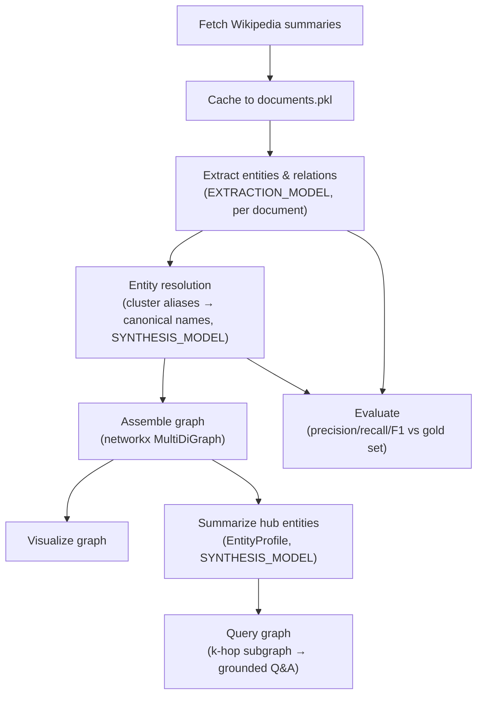

# Building a Knowledge Graph with Claude

This project builds a **knowledge graph** from unstructured text (Wikipedia article summaries) using Claude for extraction, resolution, summarization, and querying. It's an adapted, annotated version of Anthropic's [Knowledge Graph cookbook](https://platform.claude.com/cookbook/capabilities-knowledge-graph-guide), worked through end-to-end in [`kg-with-claude.ipynb`](./kg-with-claude.ipynb).

The worked example uses six Wikipedia articles about the Apollo program (Apollo program, Apollo 11, Neil Armstrong, Saturn V, Buzz Aldrin, Kennedy Space Center) to build a graph of people, organizations, locations, events, and artifacts, then queries it.

## Why a knowledge graph?

A knowledge graph represents facts as **entities** (nodes — people, places, events, artifacts, organizations) connected by **relations** (edges — verb phrases describing how two entities relate). This is a different retrieval shape than standard RAG:

- **Vector search / RAG** retrieves chunks of text that are *semantically similar* to a query. It's good at "find me passages about X."
- **A knowledge graph** retrieves *structured facts* and lets you traverse *relationships* between them. It's good at "who is connected to whom, and how" — multi-hop questions that don't hinge on any single passage being similar to the query.

The notebook's intro links two complementary cookbooks worth contrasting against this one:
- [Extracting structured JSON](https://github.com/anthropics/claude-cookbooks/blob/main/tool_use/extracting_structured_json.ipynb) — the tool-use approach to the same extraction pattern.
- [Retrieval augmented generation](https://github.com/anthropics/claude-cookbooks/blob/main/capabilities/retrieval_augmented_generation/guide.ipynb) — retrieval by similarity rather than fact traversal.
- [Contextual embeddings](https://github.com/anthropics/claude-cookbooks/blob/main/capabilities/contextual-embeddings/guide.ipynb) — enriching chunks before embedding, the same "add context before indexing" idea applied to vector search.

## Project structure

| File | Purpose |
|---|---|
| `kg-with-claude.ipynb` | The full pipeline: fetch → extract → resolve → assemble → visualize → summarize → query → evaluate. |
| `documents.pkl` | Pickled cache of the fetched Wikipedia summaries, so re-running the notebook doesn't re-hit the API. |
| `pyproject.toml` / `uv.lock` | Dependencies, managed with [uv](https://docs.astral.sh/uv/). |
| `.python-version` | Python version pin for uv. |

## Setup

```bash
uv sync
```

Create a `.env` file in this directory with your API key:

```
ANTHROPIC_API_KEY=sk-ant-...
```

Then launch the notebook (`uv run jupyter lab`, or open it in an IDE with a Jupyter extension pointed at the `.venv` created by `uv sync`).

## Core concepts

### Entities and relations (triples)

The atomic unit of a knowledge graph is a **triple**: `(source entity) --[predicate]--> (target entity)`, e.g. `(Apollo 11) --[commanded by]--> (Neil Armstrong)`. Entities carry a `type` (`PERSON`, `ORGANIZATION`, `LOCATION`, `EVENT`, `ARTIFACT`) and a short description grounded in the source text. Relations connect two extracted entities via a short verb phrase.

### Why Pydantic

Every LLM call in this notebook that needs structured data defines a `pydantic.BaseModel` describing exactly the shape expected back, for example:

```python
class Entity(BaseModel):
    name: str
    type: EntityType          # Literal["PERSON", "ORGANIZATION", "LOCATION", "EVENT", "ARTIFACT"]
    description: str

class Relation(BaseModel):
    source: str
    predicate: str
    target: str

class ExtractedGraph(BaseModel):
    entities: list[Entity]
    relations: list[Relation]
```

This model is passed straight to the Anthropic SDK's structured-output helper:

```python
response = client.messages.parse(
    model=EXTRACTION_MODEL,
    messages=[...],
    output_format=ExtractedGraph,
)
result = response.parsed_output  # an ExtractedGraph instance, not raw JSON
```

Pydantic is doing several jobs here at once:

- **Schema as contract.** The model *is* the JSON schema handed to Claude and the parser used to validate what comes back — one definition instead of a hand-maintained schema plus separate manual parsing code.
- **Type safety at the LLM boundary.** LLM output is untrusted text until it's validated. Pydantic rejects malformed output (missing fields, wrong types) right where the API call happens, instead of letting a bad shape silently propagate into the graph-building logic several cells later.
- **Closed vocabularies via `Literal`.** `EntityType` is a `Literal` of five fixed strings, so Claude's output is constrained to a known set of entity types instead of free-form strings that would need separate normalization.
- **Clean serialization.** `model_dump()` converts validated models back into plain dicts (see cell 8), which is what gets merged with extra bookkeeping fields like `source_doc` before entities go into ordinary Python data structures for the rest of the pipeline.

This same pattern — define a `BaseModel`, call `messages.parse(output_format=...)`, get a validated object back — is reused for every structured LLM output in the notebook: `ExtractedGraph` (extraction), `ResolvedClusters` (entity resolution), and `EntityProfile` (entity summarization).

### Two-model strategy

The notebook defines two model constants:

```python
EXTRACTION_MODEL = "claude-haiku-4-5"   # fast/cheap, called once per source document
SYNTHESIS_MODEL   = "claude-sonnet-4-6"  # stronger, called on smaller/aggregated inputs
```

Extraction runs once per document and doesn't require deep reasoning, so it uses the cheaper, faster model. Resolution, summarization, and querying all operate on already-extracted, more concentrated information, and benefit more from a stronger model — so they use `SYNTHESIS_MODEL`. This mirrors a common cost/quality pattern: use a cheap model for high-volume, low-complexity work, and a stronger model where reasoning quality most affects output quality.

### Entity resolution (canonicalization)

Extracting entities document-by-document produces duplicates: "Buzz Aldrin" in one article, "Edwin Aldrin" in another, both referring to the same person. Entity resolution fixes this:

1. Group raw extracted entities by `type`.
2. For each type, ask `SYNTHESIS_MODEL` to cluster names that refer to the same real-world entity, using each entity's description to avoid merging same-named-but-distinct entities.
3. The response is validated against `Cluster` (`canonical` + `aliases`) / `ResolvedClusters` models.
4. Flatten the clusters into two lookup structures: `alias_to_canonical` (any surface form → canonical name) and `canonical_information` (canonical name → type + aliases).

Every downstream step (graph assembly, summarization, evaluation) looks entities up through `alias_to_canonical` rather than raw extracted names.

### Graph representation: `networkx.MultiDiGraph`

The resolved entities and relations are assembled into a `networkx.MultiDiGraph`. The notebook is specific about why this graph type, not a plain `DiGraph`:

- **Multi-edge**: two entities can be connected by more than one distinct predicate (e.g. "launched from" *and* "operated by" between the same pair of nodes) — a `DiGraph` would only keep one edge per pair.
- **Directed**: edge direction is semantically meaningful — "Armstrong commanded Apollo 11" is not the same fact as "Apollo 11 commanded Armstrong."

Each node stores `type`, `description`, `source_docs` (which articles mention it), and `mentions` (a mention count). Each edge stores `predicate` and `source_doc`.

Visualization (`matplotlib` + `nx.spring_layout`) colors nodes by entity type and sizes them by degree, so densely-connected "hub" entities are visually obvious.

### Entity summarization — from a graph of labels to a graph of knowledge

Up to this point, each node only has a one-sentence description from a single document. The summarization step enriches high-degree ("hub") nodes into full profiles:

```python
class TimeRange(BaseModel):
    start: str  # YYYY or YYYY-MM, or "unknown"
    end: str    # YYYY or YYYY-MM, or "ongoing"

class EntityProfile(BaseModel):
    summary: str
    key_facts: list[str]
    time_range: TimeRange
```

For each hub node, the notebook gathers every source excerpt that mentions it plus its known graph relations (both incoming and outgoing edges), and asks `SYNTHESIS_MODEL` to synthesize a multi-paragraph summary, atomic key facts, and a time range — explicitly instructed not to invent facts beyond what the excerpts support. The resulting `EntityProfile` is stored on the node (`G.nodes[node]["profile"]`). This is the step that turns raw extracted labels into an actual knowledge base entry per entity.

### Graph-grounded querying (GraphRAG-style)

To answer a question using the graph rather than the model's general knowledge:

1. `serialize_subgraph(center, hops=2)` performs a breadth-first traversal outward from a center node (following edges in both directions) up to `hops` steps, and serializes the resulting subgraph's edges as `(source) --[predicate]--> (target)` lines.
2. `ask(question, graph_context)` builds a prompt instructing Claude to answer *using only* the supplied graph context and to cite the specific edges that support the answer, then falls back to an unconstrained prompt when no context is given.

The notebook runs the same question both ways (with and without graph context) to make the effect of grounding visible: without the graph, Claude answers from general world knowledge; with the graph, it's constrained to — and can cite — the specific extracted relations.

### Evaluation: precision, recall, F1 against a gold set

Knowledge graph quality is measured by comparing extracted entity names (both raw and after resolution) against a hand-labeled gold-standard set, using standard precision/recall/F1:

- **Precision** — of the entities extracted, what fraction are actually correct/expected.
- **Recall** — of the expected entities, what fraction were actually extracted.
- **F1** — harmonic mean of precision and recall.

The notebook computes this per document for raw extraction, and recall alone for the resolved (canonicalized) graph, to show whether entity resolution improves alignment with the gold set (e.g. "Edwin Aldrin" only counts as a hit if resolution correctly merged it under a name matching the gold label).

> **Note:** this evaluation cell reads `data/sample_triples.json` and `data/alias_map.json`, falling back to `capabilities/knowledge_graph/data/...`. Neither path exists in this repository — those files come from the original cookbook repo's directory layout. Running that cell as-is here will raise a `FileNotFoundError` unless you supply your own gold-standard files at one of those paths.

## Pipeline walkthrough (notebook cell map)



1. **Setup** — imports, `.env`, Anthropic client, model constants (see [Two-model strategy](#two-model-strategy)).
2. **Fetch data** — pulls Wikipedia summaries via the REST API for the six article titles, caches to `documents.pkl`. Summaries (not full articles) are used deliberately to keep token costs low; a production pipeline would chunk full documents instead, with identical extraction logic.
3. **Extract** — per document, `extract()` calls `EXTRACTION_MODEL` with a prompt instructing Claude to extract only entities central to the document, write source-grounded one-sentence descriptions, and connect every relation to an extracted entity. See [Why Pydantic](#why-pydantic).
4. **Inspect raw output** — entity/relation dumps and a per-type breakdown, useful for sanity-checking extraction before resolving.
5. **Resolve entities** — see [Entity resolution](#entity-resolution-canonicalization).
6. **Assemble the graph** — see [Graph representation](#graph-representation-networkxmultidigraph).
7. **Visualize** — colored/sized `matplotlib` plot of the graph.
8. **Summarize hub entities** — see [Entity summarization](#entity-summarization--from-a-graph-of-labels-to-a-graph-of-knowledge).
9. **Query the graph** — see [Graph-grounded querying](#graph-grounded-querying-graphrag-style).
10. **Evaluate** — see [Evaluation](#evaluation-precision-recall-f1-against-a-gold-set).

## Known limitations

- **Summaries, not full articles.** The Wikipedia REST API's summary endpoint is used to control token costs; this trades off recall of entities/relations only mentioned deeper in an article.
- **Evaluation data not included.** The gold-standard files the evaluation cell expects aren't part of this repo (see the note above).
- **Small, single-domain corpus.** Six Apollo-program articles is enough to demonstrate the pipeline end-to-end, not to stress-test entity resolution or graph traversal at scale.

## References

- [Anthropic Knowledge Graph cookbook](https://platform.claude.com/cookbook/capabilities-knowledge-graph-guide) — the source this notebook is based on.
- [Extracting structured JSON (tool-use approach)](https://github.com/anthropics/claude-cookbooks/blob/main/tool_use/extracting_structured_json.ipynb)
- [Retrieval augmented generation guide](https://github.com/anthropics/claude-cookbooks/blob/main/capabilities/retrieval_augmented_generation/guide.ipynb)
- [Contextual embeddings guide](https://github.com/anthropics/claude-cookbooks/blob/main/capabilities/contextual-embeddings/guide.ipynb)
