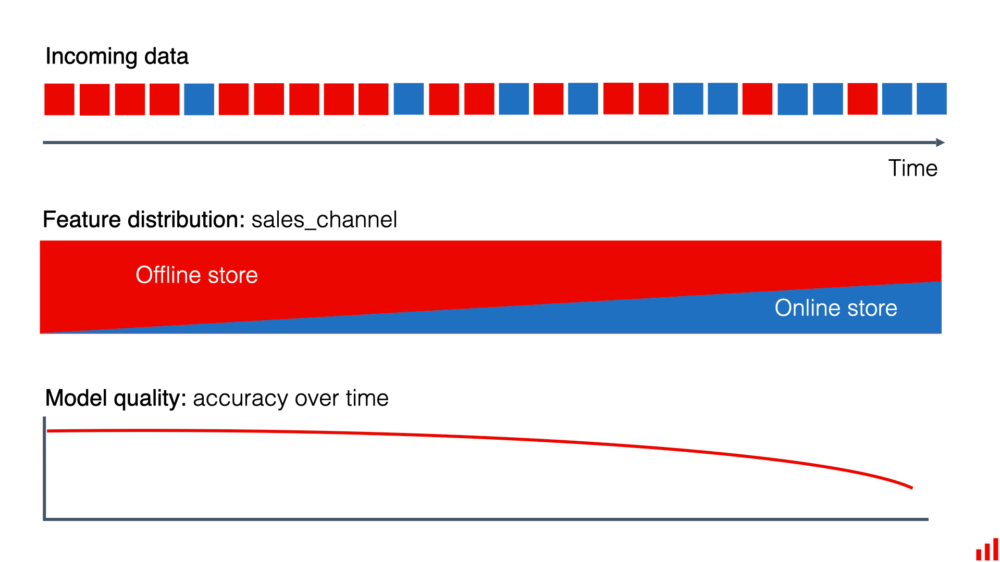

# What Is Data Drift?

*Source: [Evidently AI — "What is data drift in ML, and how to detect and handle it"](https://www.evidentlyai.com/ml-in-production/data-drift)*

> **TL;DR.** Data drift is a shift in the distributions of the ML model input features.

**Data drift** is a change in the statistical properties and characteristics of the input data. It shows up once a model is in production, as the data it encounters deviates from the data it was trained on (or from earlier production data).

This matters because a model is only expected to perform well on data similar to what it was trained on. If the incoming data keeps changing, the model can't generalize beyond what it has seen, and its predictions or decisions degrade.

In short: **data drift is a change in the model inputs the model was not trained to handle.** Detecting and addressing it is central to keeping an ML model reliable in a dynamic environment.

## Worked example: a retail demand forecaster

A retail chain uses ML to predict how many units of each product to stock per store, trained on a few years of historical **in-store** sales data. The model is good at forecasting in-store demand.

The retailer then runs a marketing campaign for their new mobile app, and online sales surge — a channel barely represented in the training data. As long as online sales were a small share of the business, the gap didn't matter. Once online volume grew, forecast quality dropped and inventory management suffered.

The shift from predominantly in-store to largely online sales is data drift: the same model, the same underlying task, but a different distribution of inputs than the one it learned from.

## A note on terminology

Several related terms show up around data drift: **concept drift, model drift, prediction drift**, and **training-serving skew**. "Data drift" also appears in data engineering and data analysis outside ML, sometimes with a different meaning.

None of these terms is strictly, universally defined. Distinguishing them (see [02-data-drift-vs-related-concepts.md](02-data-drift-vs-related-concepts.md)) helps build intuition for the different ways a production ML system can be affected — but in practice, multiple of these effects often happen simultaneously, and practitioners tend to use the terms interchangeably.
