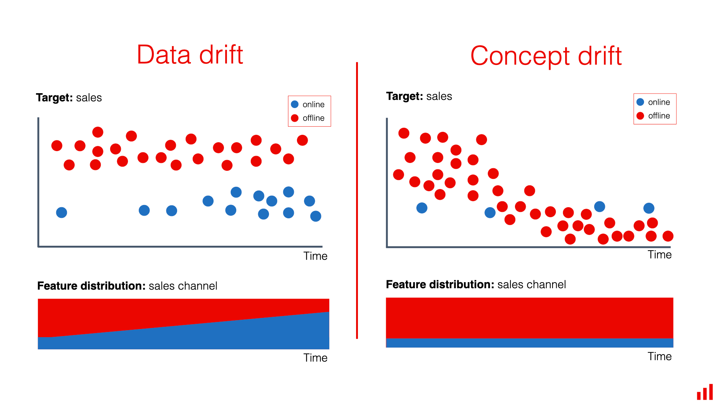
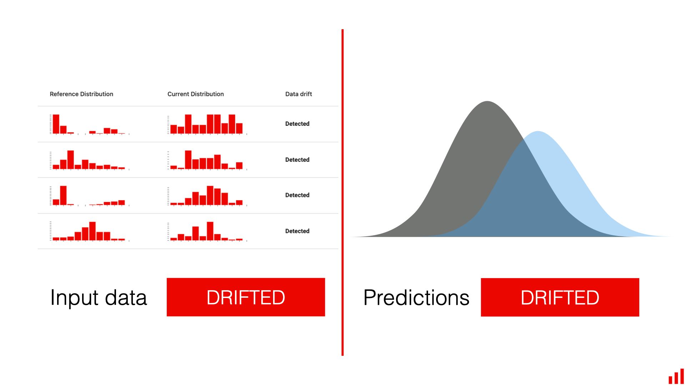
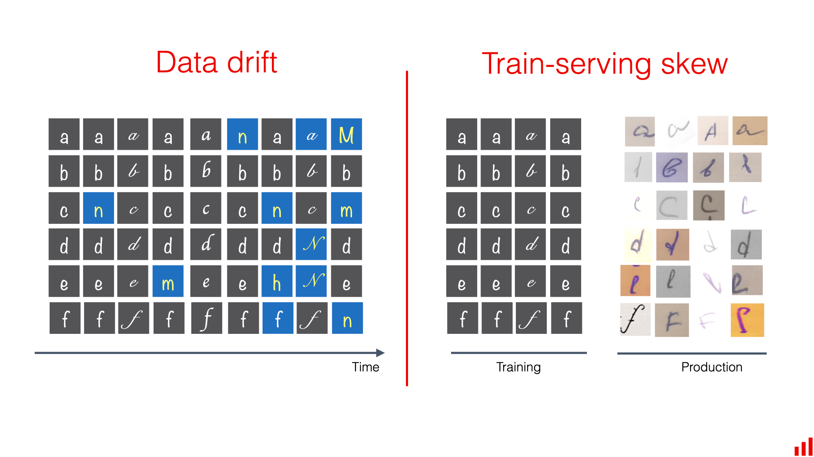
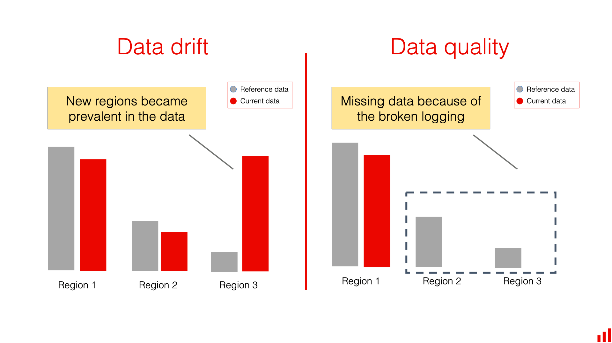
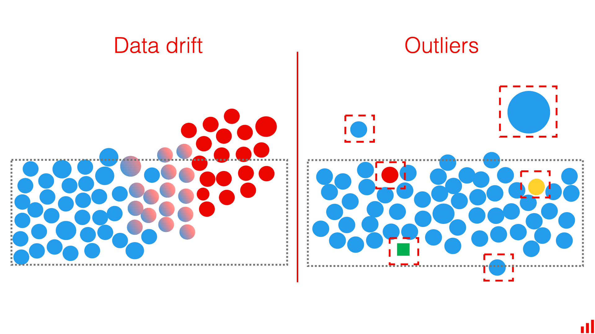

# Data Drift vs. Related Concepts

*Source: [Evidently AI — "What is data drift in ML, and how to detect and handle it"](https://www.evidentlyai.com/ml-in-production/data-drift)*

None of the terms below is strictly defined in the field. Distinguishing them helps clarify the different ways a production model can be affected — in practice, several often happen at once, and practitioners frequently use the terms interchangeably.

## Data drift vs. Concept drift

> **TL;DR.** Data drift is a change in the input data. Concept drift is a change in input–output relationships. Both often happen simultaneously.

**Data drift** describes changes in the distribution of the inputs. **Concept drift** relates to changes in the *relationship* between inputs and the target variable — whatever the model is predicting is itself changing.

Data drift can be a symptom of concept drift, and the two often co-occur, but not necessarily. In the retail example, a new marketing campaign can reshape the distribution of shopper segments (data drift) without customers' actual shopping preferences changing at all (no concept drift) — quality drops simply because a segment the model is worse at became a bigger share of the traffic.

By contrast, a new competitor undercutting prices, or a shock like COVID-19 reshaping how people shop, changes the input–output relationship itself — that's concept drift, and it can make previously good models nearly obsolete.

| | Data drift | Concept drift |
|---|---|---|
| **Difference** | Shifts in input feature distributions | Shifts in the relationship between inputs and outputs |
| **Similarity** | Both can degrade model quality and often coincide; data drift can be a monitoring symptom of underlying concept drift | |

> Want a deeper dive? See the companion explainer on **concept drift** (linked from the original article; not included in this folder).

## Data drift vs. Prediction drift

> **TL;DR.** Data drift is a change in model inputs, while prediction drift is a change in the model outputs.

**Prediction drift** is the distribution shift observed in a model's *outputs* rather than its inputs. It's often the best available proxy when model performance can't be measured directly — e.g. a fraud model starts flagging fraud far more often, or a pricing model's quotes shift noticeably lower.

Prediction drift can signal anything from low-quality inputs to underlying concept drift, but it doesn't always mean the model got worse: if fraud attempts genuinely increase, predicted-fraud distribution *should* shift, and both feature and prediction drift can be observed without any real decay in model quality.

| | Data drift | Prediction drift |
|---|---|---|
| **Difference** | Changes in model input data | Changes in model outputs |
| **Similarity** | Both are useful proxies for production monitoring when ground truth is unavailable, and both can signal a change in the model's environment | |

Some practitioners use **data drift** (or **dataset shift**) as an umbrella term covering both input and output changes.

## Data drift vs. Training-serving skew

> **TL;DR.** Training-serving skew is a mismatch between training and production data. Data drift is a shift in the distribution of production data inputs over time.

**Training-serving skew** is a mismatch between the data a model was trained on and the data it sees in production. It's broader than environmental change alone — it also covers discrepancies from data preprocessing, feature engineering, or training on synthetic/external data that doesn't fully match the production environment. It's typically visible immediately after deployment, whereas data drift is usually a more gradual process that accumulates during operation.

A common cause: a feature available during training turns out to be impossible to compute in production, or arrives with a delay — the model then lacks an attribute it was trained to rely on.

| | Data drift | Training-serving skew |
|---|---|---|
| **Difference** | Gradual change in input distributions over time | Mismatch visible shortly after launch; can include issues unrelated to environmental change |
| **Similarity** | Both concern changes in the input data, and similar distribution-comparison techniques detect both (production vs. training) | |

## Data drift vs. Data quality

> **TL;DR.** Data drift refers to the change in data distributions in otherwise valid data. Data quality issues refer to data bugs, inconsistencies, and errors.

Broadly, "data drift" can be stretched to cover any change or anomaly in data — schema changes, missing values, inconsistent formatting, incorrect inputs. That broad usage is common outside ML (database management, data analysis). Within ML, it's more useful to separate the two:

- **Data quality** issues: corrupted or incomplete data, e.g. from pipeline bugs or entry errors.
- **Data drift**: distribution shifts in data that remains otherwise correct and valid, arising from environmental change.

A practical implication: when you detect a distribution shift, first rule out a data quality cause (e.g. an accidental feature-scale change from an entry error will look like a statistical shift too). Split checks into two groups — data quality checks first (completeness, expected sign/range, etc.), then distribution checks — otherwise every drift alert requires ruling out a quality bug as the root cause.

| | Data drift | Data quality |
|---|---|---|
| **Difference** | Statistical changes in distribution, even with high-quality data | Missing values or errors in the data |
| **Similarity** | Both can cause model quality drops and both concern changes in the data; a quality issue can *cause* observed drift, and drift-detection techniques often expose quality issues | |

## Data drift vs. Outlier detection

> **TL;DR.** Data drift refers to the change in the overall data distributions. Outlier detection is focused on identifying individual anomalies in the input data.

**Drift detection** operates at the "global," whole-dataset level: has the distribution shifted enough that you should no longer trust the model behaves as it did during training?

**Outlier detection** operates at the individual-object level: does *this* input look different from the rest? The typical action is object-level — route it to a human expert, apply a business rule, or refuse to predict — which matters when the cost of a single wrong decision is high.

| | Data drift | Outlier detection |
|---|---|---|
| **Difference** | Changes in the overall data distribution; helps evaluate overall model reliability | Identifying individual unusual inputs; helps discover inputs the model is ill-equipped to handle |
| **Similarity** | Both help monitor and understand changes in input data; a rising share of outliers can foreshadow upcoming drift | |

The two can exist independently — dataset drift without any individual outliers, or outliers without dataset-level drift — and are usually designed differently: drift detectors should tolerate some outliers, while outlier detectors need to be sensitive to individual anomalies.
