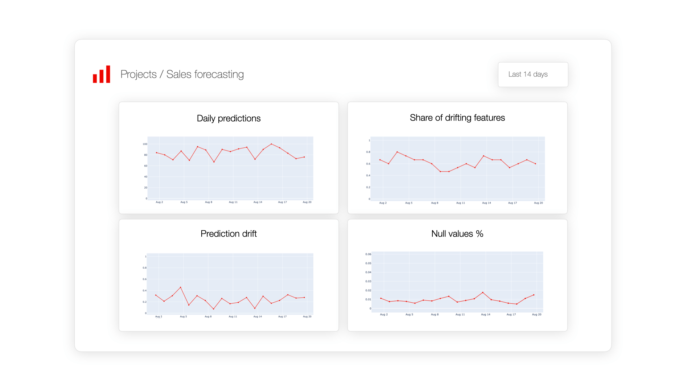
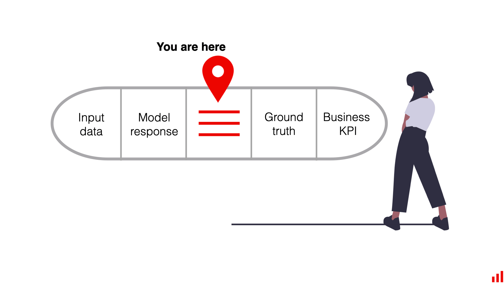
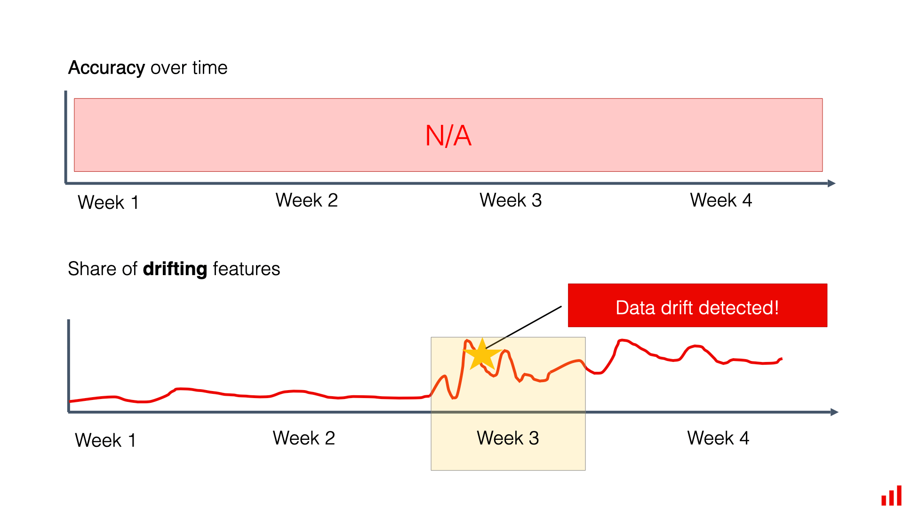
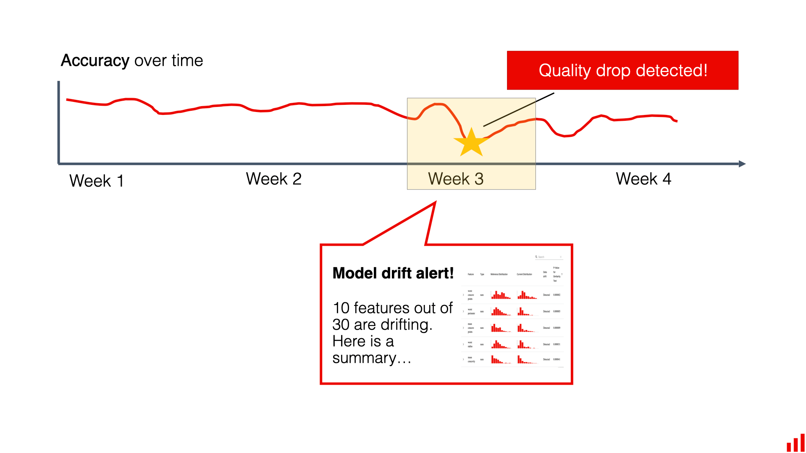

# Why Data Drift Matters

*Source: [Evidently AI — "What is data drift in ML, and how to detect and handle it"](https://www.evidentlyai.com/ml-in-production/data-drift)*

Data drift matters in production ML for three reasons: it's a fact of life models must be maintained against, it's a proxy for quality when ground truth is unavailable, and it's a debugging tool once quality has already dropped.

## Model maintenance

> **TL;DR.** ML models are not "set it and forget it" solutions. Data shifts over time, which requires a model monitoring and retraining process.

A model trained on a fixed dataset is expected to perform well on unseen real-world data, but assuming the data distribution stays static is unrealistic. Even without a dramatic event, small variations accumulate — new products appear, customer preferences evolve, market conditions shift. Sooner or later, real-world data deviates from the training data.

**Data (and concept) drift are built-in properties of a production ML system** — not an edge case. That's why ongoing model maintenance matters: a **retraining schedule** to keep the model current, and a **model monitoring** setup to give visibility into current quality and let you intervene between scheduled updates, or trigger retraining on demand.

Tracking the true model quality (accuracy, mean error, etc.) directly is usually the best signal, but it isn't always possible — see feedback delay below. In that case, early monitoring needs proxy metrics, and tracking data distribution drift is one of the main options.

## Feedback delay

> **TL;DR.** Feedback delay is a time lag between model predictions and receiving feedback on those predictions. Monitoring input data distribution drift is a valuable proxy when ground truth labels are unavailable.

**Feedback delay** occurs when there's a significant gap between a prediction and knowing whether it was correct. In a recommender system, the delay between recommending an item and learning whether the user engaged can range from seconds to days. In payment fraud detection, confirming a transaction as fraudulent or legitimate may take an investigation — sometimes weeks or months, e.g. until a customer disputes a charge.

Ground truth labels are essential for evaluating production model quality, but real-time decisions can't wait for them — and a problematic model (say, a broken fraud detector) can cause real damage before the issue is caught through delayed labels alone.

This is where **early monitoring using proxy metrics** comes in. Comparing the distribution of incoming data against previous batches — i.e. monitoring input data drift — helps detect environmental shifts that could affect performance *before* performance itself can be measured directly.

## Model debugging

> **TL;DR.** Analyzing input data distribution drift helps explain and locate the reasons for model quality drops, and surfaces important changes in the modeled process.

Data drift analysis is also useful for troubleshooting *after* a quality drop has already been observed through a direct metric like accuracy. The investigation usually comes down to looking for changes in the input data — here, drift analysis isn't necessarily used as an alerting signal, but as a debugging tool.

A simple approach: run per-feature distribution comparisons to find which features shifted the most, then visually explore those distributions and interpret the change with domain knowledge — is there a new traffic source? A new product category absent from training data? A shift in a categorical feature might point to a new emerging user segment or an uncommunicated change to the modeled process (new promotions, new geographies, etc.).
