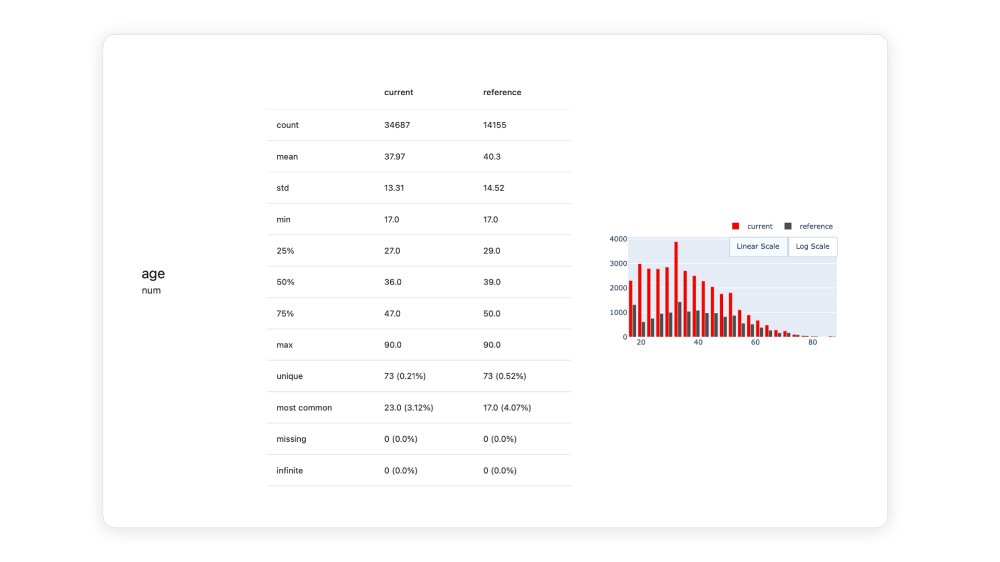
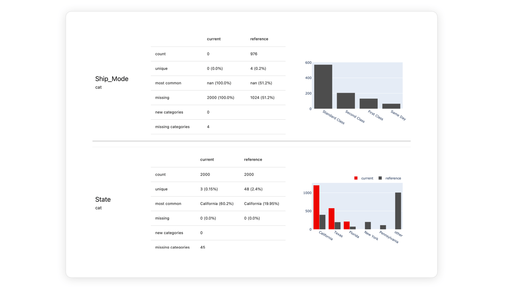
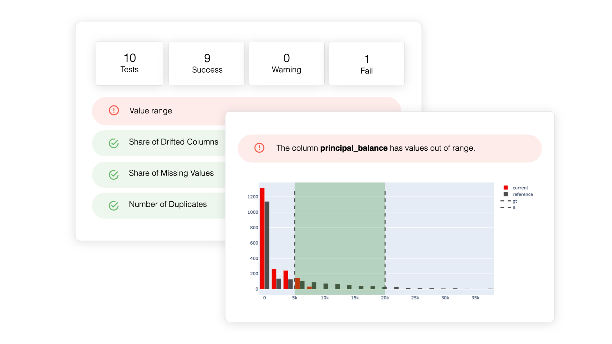

# How to Detect Data Drift

*Source: [Evidently AI — "What is data drift in ML, and how to detect and handle it"](https://www.evidentlyai.com/ml-in-production/data-drift)*

Comparing the distributions of input features (and model outputs) over time is how drift gets detected. The open question is *how different is different enough* — the four approaches below answer that in different ways.

## Summary statistics

The simplest approach: compare key statistics — mean, median, variance, quantiles — between the reference and current data. For example, flag when the current mean of a numerical variable falls outside two standard deviations of the reference value.

Watching many features this way at once gets noisy, but it's a solid strategy when you already have domain expectations about specific medians or quantiles.

You can also track **feature range compliance** — whether values stay within a min-max range — which is good at catching data quality issues (negative sales, sudden scale shifts) but can miss drift where values stay in range yet the distribution *shape* changes.

## Statistical tests

A more rigorous approach: hypothesis testing, e.g. the **Kolmogorov-Smirnov test** for numerical features or the **Chi-square test** for categorical ones. These assess whether the difference between two datasets is statistically significant — i.e. whether the datasets plausibly come from different distributions rather than sampling noise. The test output (the "drift score") is a **p-value**, a measure of confidence.

Picking the right test depends on the data's distributional assumptions (e.g. whether normality is expected). Per-feature statistical tests make the most sense with a small number of important, interpretable features, smaller datasets, and high-stakes domains like healthcare or education.

Caveat: statistical significance isn't the same as practical significance. Rule of thumb — if the difference is detectable with a small sample, it's probably meaningful; otherwise the test may just be overly sensitive at large sample sizes.

## Distance metrics

Instead of testing a same-distribution hypothesis, distance metrics quantify *how far apart* two distributions are. Common choices: **Wasserstein distance**, **Jensen-Shannon divergence**, and the **Population Stability Index (PSI)** (widely used in credit risk modeling). The output is a distance/divergence value — higher means further apart — on either an absolute scale or a 0–1 scale depending on the metric.

The benefit over hypothesis tests: you get a continuous measure of "how much" drift, trackable over time, rather than a binary same/different verdict. Distance metrics are the better fit for large datasets, since statistical tests tend to become overly sensitive at scale. You can also aggregate this into a single "share of drifted features" signal instead of tracking every feature individually.

## Rule-based checks

Simple, explicit rules can also serve as drift-alerting heuristics, e.g.:

- The share of the predicted "fraud" category exceeds 10%.
- A new categorical value appears in a feature like `location` or `product_type`.
- More than 10% of the `salary` feature's values fall outside the defined min-max range.

These don't directly measure statistical drift, but they're good, cheap heuristics for flagging changes worth investigating further.
