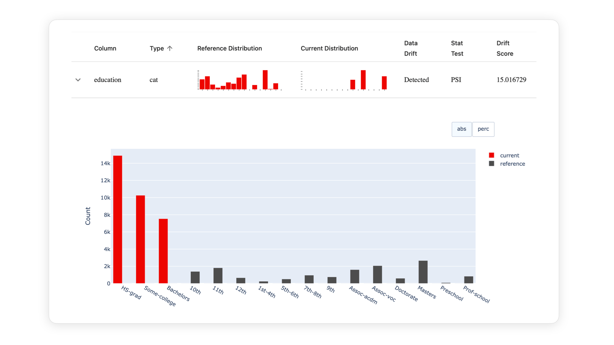
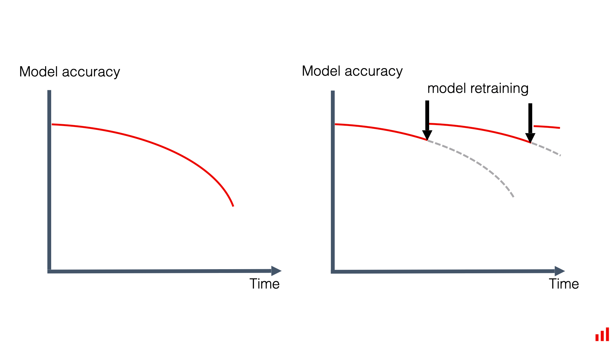
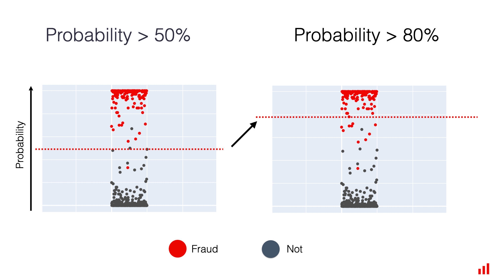

# How to Handle Data Drift

*Source: [Evidently AI — "What is data drift in ML, and how to detect and handle it"](https://www.evidentlyai.com/ml-in-production/data-drift)*

Detecting drift is only the first step. What follows is a decision process: understand it, then act.

## Analysis

Before taking any action, understand the nature of the shift. Compare the visual distributions of the drifted features to explain the source: is this a genuine data shift, a data quality bug, or a false positive?

Three common outcomes:

- **No action needed** — there's a legitimate business explanation (e.g. a product change), or you'd rather wait and accumulate enough new data before retraining.
- **Data quality bug** — many apparent "drift" cases actually trace back to a pipeline bug. This needs to be located and fixed (e.g. contacting data producers, fixing a feature transformation) — and it's exactly why using drift detection as an *automatic* retraining trigger is risky: you must verify the new data is valid before training on it.
- **False positive** — if drift alerts fire too often, consider tuning detector sensitivity. A useful rule of thumb: prioritize alerting on drift in the model's top/most important features.

If the drift is real, the next step is retraining the model or updating the decision process around it.

## Retraining

The most common industry response: retrain on the newly observed distribution, assuming labels are available and there's enough new data. Depending on how much has drifted, you can:

- Retrain on old + new data combined.
- Weight recent data more heavily, or drop old data entirely.
- Re-run feature engineering and model design from scratch for a new approach.

Whichever strategy, a robust rollout architecture and a thorough pre-release testing procedure are essential to confirm the new model is actually good enough before replacing the old one.

## Process intervention

Retraining isn't always feasible — most often because new labels simply aren't available yet. Alternatives that don't require a model update:

- **Stop the model** — halt predictions temporarily, possibly scoped to the affected segment (e.g. one product group).
- **Modify the decision process on top of the output** — e.g. lower a fraud model's flagging threshold to route more transactions to manual review.

  

- **Add business rules** — filter out or override unreliable/extreme predictions.
- **Switch decision-making processes** — fall back to an alternative model, or bring in a **human in the loop** (domain experts making the call instead of the automated system).

## Model redesign

Handling drift doesn't have to be purely reactive — model design choices can make a system more resilient up front:

- **Feature selection** — review the historical variability of candidate features before training, and drop the ones with significant historical drift.
- **Feature engineering** — e.g. bucket volatile numerical features into a limited number of categories to reduce sensitivity to shift.
- **Model choice** — sometimes a model that scores slightly lower on a historical evaluation set but is more robust to data shifts is the better production choice.
- **Domain-based or causal models** — can be more reliable under data change than purely correlational models.
