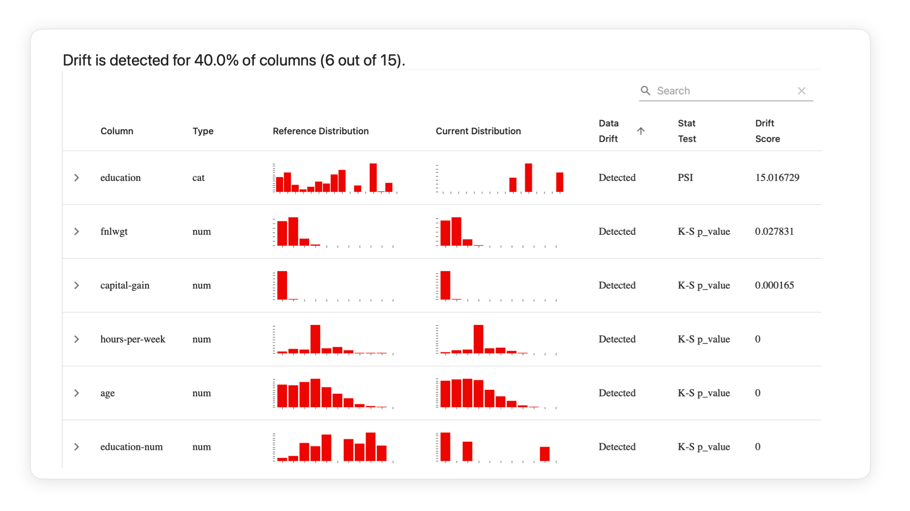

# Detecting Drift with Evidently

*Source: [Evidently AI — "What is data drift in ML, and how to detect and handle it"](https://www.evidentlyai.com/ml-in-production/data-drift)*

**Evidently** is the open-source Python library the source article uses to illustrate these ideas — it implements testing and monitoring for production ML models, including 20+ pre-built data drift detection methods with interactive visual reports.

With it you can:

- Run a **Data Drift report** to compare and visually explore every feature in a dataset.
- Implement drift checks as part of a prediction pipeline via the **Test Suite** functionality, which integrates with common workflow orchestrators.
- Evaluate drift for **unstructured data**, including raw text and embeddings.
- Deploy a **live monitoring dashboard** to track metrics over time as part of a continuous monitoring process.

## Additional resources referenced by the article

- Open-source ML observability course.
- Drift detection methods for large datasets.
- Drift detection methods for embeddings.
- Drift detection for text data using text descriptors.
- Guide: classification decision thresholds.
- Guide: interpreting prediction and data drift together.
- Guide: ML model monitoring (general).

## Related reading (companion articles, not distilled in this folder)

- **Model monitoring** — tracks the quality of ML models in production (model quality, data quality, drift, bias/fairness), distinct from software health monitoring.
- **Concept drift** — changes in the data patterns/relationships the model learned; detected via production quality drops or proxy metrics like prediction drift. See [02-data-drift-vs-related-concepts.md](02-data-drift-vs-related-concepts.md#data-drift-vs-concept-drift) for how it relates to data drift.
