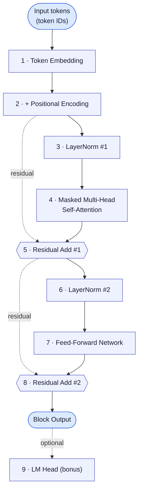
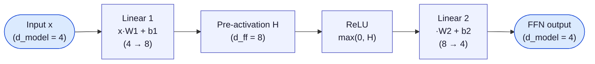

# A Transformer Block, Computed By Hand

This is a fully worked numeric example of **one decoder-only transformer block's forward pass** — every matrix, every dot product, every softmax — following the structure taught across [05-transformer-block.md](05-transformer-block.md), [06-self-attention-deep-dive.md](06-self-attention-deep-dive.md), and the MoE-lesson's recap of the decoder block (`_12_MoE.txt`):

## Architecture of the block we're computing



This is the **pre-LN** layout (normalize *before* each sub-layer, add the residual *after*) — the layout described in the transcripts ("first layer normalized before passed to the attention mechanism... layer normalized before processed by a feedforward neural network"). Notice the two dashed **residual** edges: they skip straight from *before* a sub-layer to the add-step *after* it, carrying the un-normalized signal forward unchanged — this is what lets gradients (and information) flow around the attention/FFN sub-layers instead of only through them.

> **A note on precision:** every intermediate value below is rounded to 4 decimal places for display. The underlying computation is carried out in full floating-point precision, so if you redo the arithmetic yourself using the rounded numbers shown, you may land within ~0.001 of the displayed result — that's ordinary rounding error, not a mistake. Every number here was computed with a small numpy script and is exact to the precision shown.

## 0. Toy setup

To make every step small enough to fully write out, we use:

- **Vocabulary** (6 tokens): `the`, `cat`, `sat`, `mat`, `dog`, `ran`
- **Input sequence** (3 tokens): `"the cat sat"` → token IDs `[0, 1, 2]`
- **Model dimension** `d_model = 4`
- **2 attention heads**, so `d_head = d_model / 2 = 2`
- **Feed-forward hidden dimension** `d_ff = 8`
- Activation function: **ReLU** (real models like Phi-3 use GELU/SiLU — see [08-model-walkthrough-phi3.md](08-model-walkthrough-phi3.md) — ReLU is used here purely so the arithmetic stays simple: `max(0, x)`, no exponentials)
- LayerNorm scale/shift: `gamma = [1,1,1,1]`, `beta = [0,0,0,0]` (i.e. plain normalization, no learned rescaling — the simplest valid case)
- All weight matrices below are fixed, arbitrary small numbers — **not trained**. This is a mechanics demo, not a trained model, so don't expect the final prediction to be impressively "smart" (see the closing section).

This is a **decoder-only** block (masked self-attention, causal), matching GPT/Phi-3-style models covered in [02](02-transformer-models-overview.md) and [08](08-model-walkthrough-phi3.md).

## 1. Token embeddings

Embedding matrix `E` (6 tokens × 4 dims), one row per vocabulary word:

```
          d0      d1      d2      d3
the    0.1600 -0.0400  0.2200  0.1200
cat   -0.2400  0.2900  0.1600  0.1700
sat   -0.2200 -0.0300 -0.0800  0.2600
mat    0.0900  0.1900 -0.0300 -0.1600
dog    0.0300 -0.2600  0.2000  0.0800
ran    0.1500 -0.0900  0.2800  0.2400
```

Looking up our 3 input tokens (`the`, `cat`, `sat`) just selects those 3 rows:

```
        d0      d1      d2      d3
the   0.1600 -0.0400  0.2200  0.1200
cat  -0.2400  0.2900  0.1600  0.1700
sat  -0.2200 -0.0300 -0.0800  0.2600
```

## 2. Positional encoding

### Why this step exists

Self-attention (Section 4) computes relevance between tokens purely from their *content* vectors — it has no notion of "this token comes before that one." If you shuffled the 3 input tokens, raw self-attention would produce the same set of pairwise scores, just reordered. But word order matters ("dog bites man" ≠ "man bites dog"), so *something* has to inject position information into the vectors before they reach attention. That something is positional encoding.

### Input and output of this step

- **Input:** a position index `pos` (0, 1, 2, … — where the token sits in the sequence) and the model dimension `d_model = 4` (fixed, shared with the embeddings). Note the token's *identity* plays no role here — position 1 gets the same encoding whether it holds `cat`, `dog`, or any other token.

> **Don't confuse position with token ID.** In this walkthrough the input `"the cat sat"` has token IDs `[0, 1, 2]` (Section 1's vocabulary indices for `the`/`cat`/`sat`) *and* sits at positions `[0, 1, 2]` (this section's sequence slots) — the numbers line up only by coincidence of which example sentence was picked. Token ID = which word it is (fixed per word, from the vocabulary); position = where it sits in *this* sequence (independent of which word occupies that slot). If the input were `"cat the sat"` instead, the token IDs would be `[1, 0, 2]` while the positions would still be `[0, 1, 2]` — same words, different ID order, unchanged position order.
- **Output:** one vector of length `d_model = 4` per position — a `PE` matrix of shape `(seq_len, d_model)` = `(3, 4)`, the same shape as the token embedding matrix from Section 1. That shape-match is exactly the point: it lets the two be combined elementwise (added together) to produce a single vector per token that carries both *what* the token is and *where* it is.

### The formula, dimension by dimension

$$PE_{(pos,\,2i)} = \sin\left(\frac{pos}{10000^{2i/d_{model}}}\right) \qquad PE_{(pos,\,2i+1)} = \cos\left(\frac{pos}{10000^{2i/d_{model}}}\right)$$

Read this as: walk across the 4 dimensions of the output vector two at a time. Each pair `(2i, 2i+1)` — i.e. `(dim 0, dim 1)` for `i=0`, `(dim 2, dim 3)` for `i=1` — gets a `sin`/`cos` pair computed at the *same frequency*, but each pair uses a different frequency, controlled by `i`:

- `i = 0` → divisor `10000^{0/4} = 1` → **highest frequency** (the `sin`/`cos` value changes quickly as `pos` increases: 0 → 1 → 2 → …)
- `i = 1` → divisor `10000^{2/4} = 100` → **lower frequency** (changes much more slowly as `pos` increases: 0 → 0.01 → 0.02 → …)

With only 4 dimensions here we get 2 frequency bands; a real model with `d_model = 4096` would get 2048 bands, ranging from very fast-changing to extremely slow-changing. Stacking many frequencies together is what makes each position's *combination* of values unique (like a mixed-radix clock: seconds, minutes, hours hands together uniquely identify a moment even though the seconds hand alone repeats every 60 ticks) — and it also gives the encoding a useful property: the encoding for position `pos + k` turns out to be a fixed linear function of the encoding for position `pos` (a consequence of angle-addition identities for `sin`/`cos`), which is thought to make it easier for the model to learn to attend by *relative* position.

**Worked example — position 1 (`cat`), dims 0–1** (`i = 0`, so the divisor is `10000^0 = 1`):

$$PE_{(1,0)} = \sin(1/1) = \sin(1) = 0.8415 \qquad PE_{(1,1)} = \cos(1/1) = \cos(1) = 0.5403$$

**Position 1, dims 2–3** (`i = 1`, divisor `10000^{2/4} = 100`):

$$PE_{(1,2)} = \sin(1/100) = \sin(0.01) = 0.0100 \qquad PE_{(1,3)} = \cos(1/100) = \cos(0.01) = 1.0000$$

Note position 0 is always `[sin(0), cos(0), sin(0), cos(0)] = [0, 1, 0, 1]` for every model — the first token's encoding is fixed regardless of vocabulary or content.

Full positional encoding for all 3 positions:

```
        d0      d1      d2      d3
pos0  0.0000  1.0000  0.0000  1.0000
pos1  0.8415  0.5403  0.0100  1.0000
pos2  0.9093 -0.4161  0.0200  0.9998
```

### Combining with the token embeddings

The output of this step is added **elementwise** to the token embedding matrix from Section 1 (same `(3, 4)` shape, so no reshaping needed) — position information and token identity are literally summed into one vector, not kept as separate channels. This combined matrix, call it `X`, is what actually flows into the rest of the block; from here on, the transformer has no separate memory of "the raw embedding" vs. "the position" — only their sum.

**Block input** `X` = token embedding (Section 1) + positional encoding (elementwise):

```
        d0      d1      d2      d3
the   0.1600  0.9600  0.2200  1.1200
cat   0.6015  0.8303  0.1700  1.1700
sat   0.6893 -0.4461 -0.0600  1.2598
```

For example, `X[cat] = [-0.2400, 0.2900, 0.1600, 0.1700] + [0.8415, 0.5403, 0.0100, 1.0000] = [0.6015, 0.8303, 0.1700, 1.1700]` — the row shown above for `cat`.

## 3. LayerNorm #1

For each token vector `x` (length 4), LayerNorm computes:

$$\hat{x} = \frac{x - \mu}{\sqrt{\sigma^2 + \epsilon}} \quad (\times\, \gamma + \beta,\text{ here }\gamma{=}1,\beta{=}0) \qquad \mu = \text{mean}(x) \qquad \sigma^2 = \text{var}(x) \qquad \epsilon = 10^{-5}$$

**Worked example — token `the`**, `x = [0.1600, 0.9600, 0.2200, 1.1200]`:

- Mean: `μ = (0.1600 + 0.9600 + 0.2200 + 1.1200) / 4 = 2.4600 / 4 = 0.6150`
- Deviations: `[-0.4550, 0.3450, -0.3950, 0.5050]`
- Variance: `σ² = (0.4550² + 0.3450² + 0.3950² + 0.5050²) / 4 = (0.2070 + 0.1190 + 0.1560 + 0.2550) / 4 = 0.1843`
- `√(σ² + ε) = √0.184310 = 0.4293`
- Normalized: `[-0.4550/0.4293, 0.3450/0.4293, -0.3950/0.4293, 0.5050/0.4293] = [-1.0599, 0.8037, -0.9201, 1.1764]`

Doing this for all 3 tokens (mean/variance shown per token):

| token | mean μ | variance σ² |
|---|---|---|
| the | 0.6150 | 0.1843 |
| cat | 0.6929 | 0.1321 |
| sat | 0.3607 | 0.4361 |

**LayerNorm #1 output** (this is what feeds self-attention):

```
        d0      d1      d2      d3
the  -1.0599  0.8037 -0.9201  1.1764
cat  -0.2517  0.3780 -1.4389  1.3126
sat   0.4975 -1.2219 -0.6371  1.3614
```

## 4. Self-attention (2 heads)

Sub-steps 4a–4h below all happen **inside** this single "Masked Multi-Head Self-Attention" box.

### 4a. Projection weight matrices

**What these matrices are.** `W_Q`, `W_K`, `W_V`, `W_O` are ordinary learnable weight matrices — the same kind of object as the FFN's `W1`/`W2` in Section 7 or the LM head's `W_lm` in Section 9. Each has shape `d_model × d_model` (here `4×4`) so it maps a token's `d_model`-length vector to another `d_model`-length vector via matrix multiplication:

- `W_Q`, `W_K`, `W_V` transform the LayerNorm'd token vectors into the **query**, **key**, and **value** spaces described in [06-self-attention-deep-dive.md](06-self-attention-deep-dive.md) — three different "views" of the same input, each learned to serve a different purpose (deciding what a token is *looking for*, what it *offers to be matched against*, and what it *offers to hand over* once matched).
- `W_O` is applied *after* the heads are concatenated back together (Section 4h) — it lets the model mix and recombine information across heads before the result gets added back to the residual stream.

Every layer in a stacked model has its **own independent** copy of `W_Q/W_K/W_V/W_O` — layer 5's attention weights are unrelated to layer 12's. Within a layer, each **head** also has its own slice of `W_Q/W_K/W_V` (that's what Section 4c's split accomplishes) — the efficient variants in [06](06-self-attention-deep-dive.md) (MQA, GQA) work by relaxing exactly this: sharing `W_K`/`W_V` across heads instead of giving every head its own.

**How they're defined in a real model.** They start out **randomly initialized** (small random numbers, e.g. via Xavier/Glorot-style initialization — not zeros, and not hand-picked) before any training happens. The model has no built-in notion of "query" or "relevance" at that point; those roles emerge purely from what training pressures the matrices toward.

**Are they updated?** Yes — during training, `W_Q/W_K/W_V/W_O` (along with every other weight matrix in the model: embeddings, LayerNorm's `γ`/`β`, FFN weights, LM head) are updated via **backpropagation and gradient descent**, the same mechanism used for every neural network. At each training step: run a forward pass, compare the predicted next-token distribution (Section 9) against the actual next token in the training text, compute a loss, then nudge every weight — including these four matrices — slightly in the direction that would have reduced that loss. Repeated over billions of tokens, this is *how* the matrices come to encode useful notions like "attend to the subject when resolving a pronoun" (the `"it"` → `dog`/`llama` example from [05-transformer-block.md](05-transformer-block.md)) — nobody designs that behavior by hand; it's discovered. At **inference time** (i.e., everything happening in this walkthrough) the weights are frozen — no updates occur, only forward-pass computation.

In this toy example, `W_Q/W_K/W_V/W_O` below are **fixed, arbitrary small numbers I chose by hand** — standing in for "some already-trained values," the same convention used for every other weight matrix in this doc (see [Section 0](#0-toy-setup)). They are not the result of any training run, so don't read meaning into their specific numbers.

Fixed, small, untrained weight matrices (each `4×4`):

```
W_Q                              W_K
 0.17 -0.18 -0.02 -0.27          -0.04  0.20  0.12 -0.11
-0.21  0.11  0.15  0.28           0.20  0.18 -0.07 -0.13
-0.10 -0.08 -0.02 -0.19           0.11 -0.22 -0.18 -0.30
-0.22 -0.01 -0.16  0.10           0.17  0.10  0.12  0.17

W_V                              W_O
-0.02  0.04 -0.22 -0.23           0.21 -0.16 -0.27 -0.13
 0.10 -0.02  0.04  0.16          -0.12  0.10  0.03  0.17
 0.08  0.03  0.04 -0.12           0.10 -0.06  0.19 -0.20
-0.28 -0.04 -0.17 -0.05          -0.29 -0.25  0.13 -0.02
```

### 4b. Compute Q, K, V

`Q = LN1_output @ W_Q`, and likewise for `K`, `V`. Each output row is a dot product of the token's LN1 vector with each *column* of the weight matrix.

**Worked example — `Q[the, dim 0]`** (row `the` from LN1 output, dotted with column 0 of `W_Q = [0.17, -0.21, -0.10, -0.22]`):

$$Q_{the,0} = (-1.0599)(0.17) + (0.8037)(-0.21) + (-0.9201)(-0.10) + (1.1764)(-0.22)$$
$$= -0.1802 - 0.1688 + 0.0920 - 0.2588 = -0.5158 \approx -0.5157$$

Doing this for every row/column gives the full Q, K, V matrices:

```
Q                                 K
       d0      d1      d2      d3        d0      d1      d2      d3
the -0.5157  0.3410 -0.0281  0.8037   the  0.3019  0.2527  0.1233  0.4881
cat -0.2670  0.1889 -0.1195  0.5784   cat  0.1505  0.4655  0.3599  0.6334
sat  0.1054 -0.1866 -0.3983 -0.2193   sat -0.1029  0.1559  0.4233  0.5267

V
       d0      d1      d2      d3
the -0.3014 -0.1331  0.0285  0.4240
cat -0.4398 -0.1133 -0.2102  0.2254
sat -0.5643 -0.0292 -0.4153 -0.3015
```

### 4c. Split into heads

With `d_head = 2`, **head 1** takes dims `[0,1]`, **head 2** takes dims `[2,3]` of Q/K/V.

```
Head 1 Q              Head 1 K          Head 1 V
the -0.5157  0.3410   0.3019  0.2527   -0.3014 -0.1331
cat -0.2670  0.1889   0.1505  0.4655   -0.4398 -0.1133
sat  0.1054 -0.1866  -0.1029  0.1559   -0.5643 -0.0292

Head 2 Q               Head 2 K         Head 2 V
the -0.0281  0.8037   0.1233  0.4881    0.0285  0.4240
cat -0.1195  0.5784   0.3599  0.6334   -0.2102  0.2254
sat -0.3983 -0.2193   0.4233  0.5267   -0.4153 -0.3015
```

### 4d. Scaled dot-product scores, per head

$$\text{scores} = \frac{QK^\top}{\sqrt{d_{head}}} \qquad \sqrt{d_{head}} = \sqrt{2} = 1.4142$$

**Worked example — Head 1, `cat` attending to `the`** (row `cat` of Q, dotted with row `the` of K):

$$\frac{Q^{(1)}_{cat} \cdot K^{(1)}_{the}}{\sqrt2} = \frac{(-0.2670)(0.3019) + (0.1889)(0.2527)}{1.4142} = \frac{-0.0806 + 0.0477}{1.4142} = \frac{-0.0329}{1.4142} = -0.0233$$

Full raw score matrices (rows = query token, columns = key token):

```
Head 1 raw scores               Head 2 raw scores
        the     cat     sat             the     cat     sat
the  -0.0491  0.0574  0.0751     the   0.2749  0.3528  0.2909
cat  -0.0233  0.0337  0.0403     cat   0.1892  0.2287  0.1797
sat  -0.0109 -0.0502 -0.0282     sat  -0.1104 -0.1996 -0.2009
```

### 4e. Causal mask

Because this is a **decoder** block (see [02](02-transformer-models-overview.md)/[05](05-transformer-block.md)), a token can only attend to itself and tokens *before* it — everything above the diagonal is masked to `-∞` before the softmax, so it becomes exactly `0` probability:

```
Head 1 masked                          Head 2 masked
        the       cat       sat               the       cat       sat
the  -0.0491    -inf      -inf         the   0.2749    -inf      -inf
cat  -0.0233   0.0337     -inf         cat   0.1892   0.2287     -inf
sat  -0.0109  -0.0502   -0.0282        sat  -0.1104  -0.1996   -0.2009
```

`the` (position 0) can only see itself. `cat` (position 1) can see `the` and `cat`. `sat` (position 2) can see all three — this is exactly the "mask removes the upper diagonal" rule from [02-transformer-models-overview.md](02-transformer-models-overview.md).

### 4f. Softmax → attention weights

$$\text{softmax}(z)_j = \frac{e^{z_j}}{\sum_k e^{z_k}}$$

**Worked example — Head 1, row `cat`**: unmasked scores are `[-0.0233, 0.0337]` (the `sat` column is masked out entirely, contributing 0).

$$e^{-0.0233} = 0.9770 \qquad e^{0.0337} = 1.0343 \qquad \text{sum} = 2.0113$$
$$\text{weight}_{the} = 0.9770/2.0113 = 0.4858 \qquad \text{weight}_{cat} = 1.0343/2.0113 = 0.5142$$

Full attention weight matrices:

```
Head 1 weights                         Head 2 weights
        the     cat     sat                    the     cat     sat
the  1.0000  0.0000  0.0000            the   1.0000  0.0000  0.0000
cat  0.4858  0.5142  0.0000            cat   0.4901  0.5099  0.0000
sat  0.3397  0.3265  0.3338            sat   0.3536  0.3234  0.3230
```

Note token `the` always attends 100% to itself (it has nothing else to look at), and each row sums to 1.0 — matching the "scores add up to 100%" framing from [06-self-attention-deep-dive.md](06-self-attention-deep-dive.md).

### 4g. Weighted sum of values

$$\text{head\_output} = \text{weights} \times V$$

**Worked example — Head 1, `cat`**: weights `[0.4858, 0.5142, 0.0000]` against `V^{(1)} = [[-0.3014,-0.1331], [-0.4398,-0.1133], [-0.5643,-0.0292]]`:

$$0.4858\,(-0.3014,-0.1331) + 0.5142\,(-0.4398,-0.1133) = (-0.1465,-0.0647) + (-0.2262,-0.0583) = (-0.3726,-0.1229)$$

Full per-head outputs:

```
Head 1 output                Head 2 output
        d0       d1                 d0      d1
the  -0.3014 -0.1331          the   0.0285  0.4240
cat  -0.3726 -0.1229          cat  -0.0932  0.3227
sat  -0.4344 -0.0920          sat  -0.1920  0.1254
```

### 4h. Concatenate heads and project

Concatenate Head 1 + Head 2 outputs back into `4` dims, then multiply by the output projection `W_O`:

```
Concatenated (3x4)                    Self-attention output = concat @ W_O
        d0       d1      d2      d3           d0       d1      d2      d3
the  -0.3014 -0.1331  0.0285  0.4240    the  -0.1674 -0.0728  0.1379  0.0024
cat  -0.3726 -0.1229 -0.0932  0.3227    cat  -0.1664 -0.0278  0.1212  0.0397
sat  -0.4344 -0.0920 -0.1920  0.1254    sat  -0.1358  0.0405  0.0943  0.0767
```

## 5. Residual connection #1

Add the self-attention output back to the **block input** `X` (the residual/"direct path" from `_12_MoE.txt`'s decoder recap):

```
        d0      d1      d2      d3
the  -0.0074  0.8872  0.3579  1.1224
cat   0.4351  0.8025  0.2912  1.2097
sat   0.5535 -0.4057  0.0343  1.3365
```

## 6. LayerNorm #2

Same procedure as step 3, applied to the residual output:

| token | mean μ | variance σ² |
|---|---|---|
| the | 0.5900 | 0.1956 |
| cat | 0.6846 | 0.1267 |
| sat | 0.3797 | 0.4205 |

```
        d0      d1      d2      d3
the  -1.3507  0.6719 -0.5247  1.2036
cat  -0.7011  0.3313 -1.1054  1.4752
sat   0.2681 -1.2112 -0.5326  1.4756
```

## 7. Feed-forward network

Two linear layers around a ReLU: `FFN(x) = ReLU(x·W1 + b1)·W2 + b2`. This is the "expands then shrinks back down" dense network from [05-transformer-block.md](05-transformer-block.md) — here expanding from 4 dims to 8 (`d_ff`) and back to 4.



The "expand" happens in Linear 1 (4 → 8 dims, widening the representation so the network has more room to combine features), ReLU introduces the only non-linearity in the whole sub-layer (without it, two linear layers back to back would collapse into a single linear layer), and Linear 2 "shrinks back down" (8 → 4) so the output can be added back to the residual stream, which is also 4-dimensional.

```
W1 (4x8)
-0.20  0.00 -0.21  0.12 -0.03 -0.07 -0.12  0.08
-0.08 -0.25 -0.23  0.28  0.25  0.12 -0.14  0.28
 0.17  0.13 -0.03 -0.14 -0.24  0.24 -0.03 -0.18
-0.12  0.05 -0.19  0.21  0.16  0.13 -0.04  0.08

b1 = [0.05, 0.09, -0.25, -0.05, -0.28, 0.00, -0.10, -0.21]

W2 (8x4)
-0.24  0.05 -0.20  0.26
 0.05 -0.09  0.05 -0.29
 0.28 -0.01  0.17 -0.25
-0.01 -0.01  0.26  0.04
-0.02 -0.14 -0.10  0.01
-0.04 -0.29  0.20  0.24
-0.22  0.03 -0.23  0.10
-0.13  0.10  0.14  0.16

b2 = [-0.24, 0.25, -0.16, -0.28]
```

**Worked example — hidden unit 0, for token `the`** (LN2 output `[-1.3507, 0.6719, -0.5247, 1.2036]` dotted with `W1` column 0 `[-0.20, -0.08, 0.17, -0.12]`, plus bias):

$$(-1.3507)(-0.20) + (0.6719)(-0.08) + (-0.5247)(0.17) + (1.2036)(-0.12) + 0.05$$
$$= 0.2701 - 0.0538 - 0.0892 - 0.1444 + 0.05 = 0.0328$$

Since `0.0328 > 0`, ReLU leaves it unchanged.

**Pre-activation `H` (3×8)**, then **after ReLU** (every negative value clipped to 0):

```
Pre-activation H
        h0      h1      h2      h3      h4      h5      h6      h7
the   0.0328 -0.0860 -0.3338  0.3023  0.2470  0.2057 -0.0644  0.0608
cat  -0.2012 -0.0628 -0.4261  0.4232  0.3252  0.0153 -0.0881  0.1437
sat  -0.1743  0.3973 -0.2921  0.0275 -0.2269 -0.1001 -0.0057 -0.3138

After ReLU
        h0      h1      h2      h3      h4      h5      h6      h7
the   0.0328  0.0000  0.0000  0.3023  0.2470  0.2057  0.0000  0.0608
cat   0.0000  0.0000  0.0000  0.4232  0.3252  0.0153  0.0000  0.1437
sat   0.0000  0.3973  0.0000  0.0275  0.0000  0.0000  0.0000  0.0000
```

**Worked example — FFN output dim 0, for token `the`** (ReLU output `[0.0328,0,0,0.3023,0.2470,0.2057,0,0.0608]` dotted with `W2` column 0 `[-0.24,0.05,0.28,-0.01,-0.02,-0.04,-0.22,-0.13]`, plus `b2[0] = -0.24`):

$$(0.0328)(-0.24) + (0.3023)(-0.01) + (0.2470)(-0.02) + (0.2057)(-0.04) + (0.0608)(-0.13) - 0.24$$
$$= -0.0079 - 0.0030 - 0.0049 - 0.0082 - 0.0079 - 0.24 = -0.2720$$

(Terms for `h1, h2, h6` drop out — their ReLU output is `0`.)

**Full FFN output**:

```
        d0      d1      d2      d3
the  -0.2720  0.1605 -0.0630 -0.1978
cat  -0.2700  0.2102 -0.0593 -0.2332
sat  -0.2204  0.2140 -0.1330 -0.3941
```

## 8. Residual connection #2 → block output

Add the FFN output back to the output of **residual #1** (step 5) — this is the final output of the transformer block, one vector per input token, same shape (`3×4`) as the block's input:

```
        d0      d1      d2      d3
the  -0.2794  1.0477  0.2949  0.9245
cat   0.1650  1.0127  0.2318  0.9765
sat   0.3331 -0.1917 -0.0986  0.9424
```

These 3 vectors are exactly what would be fed into the **next** transformer block in the stack (per [05-transformer-block.md](05-transformer-block.md)'s "flow through the model") — or, if this were the last block, into the LM head.

## 9. Bonus: LM head, logits, and next-token prediction

This step is marked "bonus" because it's not technically part of the transformer *block* — in a real model it only runs after the **last** block in the stack (see [04-llm-architecture-pipeline.md](04-llm-architecture-pipeline.md)), not after every block.

Following [04-llm-architecture-pipeline.md](04-llm-architecture-pipeline.md) and the real walkthrough in [08-model-walkthrough-phi3.md](08-model-walkthrough-phi3.md): take the **last token's** block-output vector (`sat`, since we want to predict what comes after `"the cat sat"`) and project it to vocabulary-sized logits with an LM head weight matrix `W_lm` (`4×6`):

**Why only `sat`'s vector?** Every one of the 3 positions (`the`, `cat`, `sat`) has its own final block-output vector, and `vector @ W_lm` is a perfectly valid operation on any of them — `the`'s vector would produce 6 logits predicting "what comes after `the`," `cat`'s vector would produce 6 logits predicting "what comes after `cat`," and so on. In fact, **during training** the model does exactly this at every position simultaneously, comparing each position's predicted logits against the actual next token in the training text, to compute the loss that updates every weight matrix (including this `W_lm`). But at **inference/generation time**, only the *last* position's prediction is unknown and useful — you already know what follows `the` and `cat`, it's sitting right there in the input (`cat` and `sat`). Only the token after the sequence's final position, `sat`, hasn't been generated yet, which is why this section computes logits for `sat` alone.

```
W_lm (4x6)
       the      cat      sat      mat      dog      ran
d0    0.03    -0.08     0.20     0.18    -0.11     0.27
d1   -0.13     0.01    -0.15     0.26    -0.20    -0.27
d2   -0.04     0.30     0.24     0.15     0.23     0.24
d3    0.01    -0.11     0.16     0.10    -0.08    -0.24
```

`sat`'s final vector: `[0.3331, -0.1917, -0.0986, 0.9424]`. Logits `= vector @ W_lm`:

```
logits = [0.0483, -0.1618, 0.2225, 0.0896, -0.0964, -0.1081]
```

Softmax over the 6 vocabulary logits gives next-token probabilities. Recall the formula: $\text{softmax}(x_i) = e^{x_i} / \sum_j e^{x_j}$ — exponentiate every logit, then divide each by the sum of all six exponentials.

**Step 1 — exponentiate each logit:**

$$e^{0.0483}\approx1.0495 \quad e^{-0.1618}\approx0.8506 \quad e^{0.2225}\approx1.2492 \quad e^{0.0896}\approx1.0937 \quad e^{-0.0964}\approx0.9081 \quad e^{-0.1081}\approx0.8975$$

**Step 2 — sum them:**

$$1.0495 + 0.8506 + 1.2492 + 1.0937 + 0.9081 + 0.8975 = 6.0487$$

**Step 3 — divide each exponentiated logit by that sum:**

$$P(\text{the}) = \frac{1.0495}{6.0487} \approx 0.1735 \qquad P(\text{cat}) = \frac{0.8506}{6.0487} \approx 0.1406 \qquad P(\text{sat}) = \frac{1.2492}{6.0487} \approx 0.2065$$
$$P(\text{mat}) = \frac{1.0937}{6.0487} \approx 0.1808 \qquad P(\text{dog}) = \frac{0.9081}{6.0487} \approx 0.1501 \qquad P(\text{ran}) = \frac{0.8975}{6.0487} \approx 0.1484$$

| token | $e^{\text{logit}}$ | probability |
|---|---|---|
| the | 1.0495 | 0.1735 |
| cat | 0.8506 | 0.1406 |
| **sat** | **1.2492** | **0.2065** |
| mat | 1.0937 | 0.1808 |
| dog | 0.9081 | 0.1501 |
| ran | 0.8975 | 0.1484 |

Check: the six probabilities sum to $0.1735+0.1406+0.2065+0.1808+0.1501+0.1484 = 0.9999 \approx 1.0000$ (off by rounding only) — softmax always produces a valid probability distribution, by construction.

**Greedy decoding** (pick the argmax — see [04-llm-architecture-pipeline.md](04-llm-architecture-pipeline.md)) selects the predicted next token. `argmax` just means: scan every candidate's probability and keep whichever is largest.

$$\arg\max\big(P(\text{the}),\ P(\text{cat}),\ P(\text{sat}),\ P(\text{mat}),\ P(\text{dog}),\ P(\text{ran})\big) = \arg\max\big(0.1735,\ 0.1406,\ 0.2065,\ 0.1808,\ 0.1501,\ 0.1484\big)$$

Comparing all six pairwise, `sat`'s `0.2065` beats every other entry (the closest competitor is `mat` at `0.1808`, still `0.0257` lower) — so `argmax` returns **`sat`** as the predicted next token. Note that `argmax` returns the *token*, not the probability value itself: the model isn't reporting "20.65% confidence," it's using that probability only to decide *which single token wins*.

This is the exact same operation shown with the real Phi-3 model in [08-model-walkthrough-phi3.md](08-model-walkthrough-phi3.md) — `block_output[-1] @ W_lm → softmax → argmax` — just at toy scale (`d_model=4`, `vocab=6`) instead of production scale (`d_model=3072`, `vocab=32064`).

**Why the prediction looks unremarkable:** the probabilities above are close to uniform (all roughly `1/6 ≈ 0.167`) and the "winning" token (`sat`, repeating itself) isn't a linguistically sensible continuation. That's expected — every weight matrix in this walkthrough was picked arbitrarily, not learned from data. A real model's weights are the result of training on massive text corpora specifically so that, e.g., `"the cat sat"` confidently predicts `"mat"` (or `"on"`) with high probability. The mechanics you just traced by hand — embeddings, positional encoding, LayerNorm, masked multi-head self-attention, residuals, feed-forward network, LM head — are identical either way; only the *numbers inside the weight matrices* differ between an untrained model like this one and a trained model like Phi-3.
